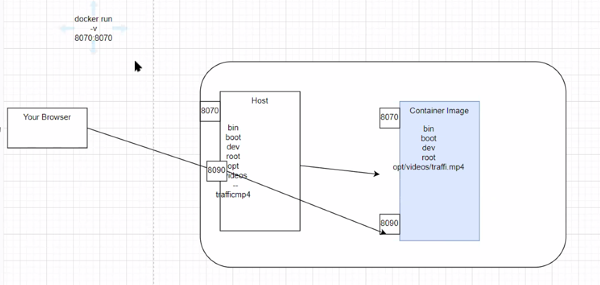
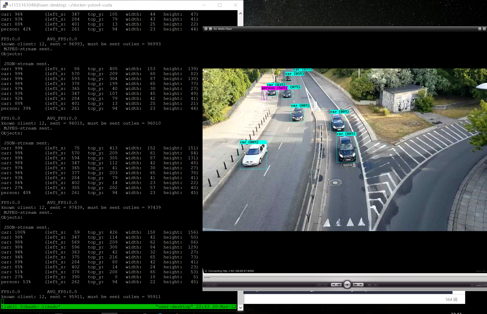
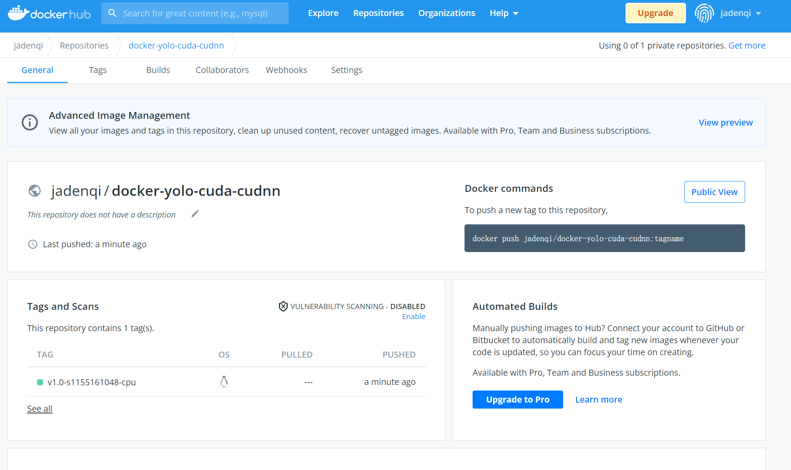
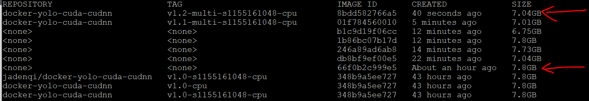

#### 1. Choose base image, shopping from docker image.

Search 'cudnn', use arm64 architecture, ubuntu (18 more mature), development version.

'cudnn' is to speedup

create file Dockerfile and input:

```
FROM nvidia/cuda:11.5.1-cudnn8-devel-ubuntu18.04
```

```
sudo docker build -t docker-yolov4-cuda:v0.1
```

#### 2. Build Dockerfile.

==Error== Limited latest version CUDA is 10.2 so current base image is not working, but the CPU version is OK.

==Solution?== Use NVIDIA_DISABLE_REQUIRE = 1 to pass the version check. ==Trying==

==Solution?== Find a container image that meets the needs of CUDA version. ==Trying==

```shell
docker run --runtime nvidia --gpus all --env NVIDIA_DISABLE_REQUIRE=1 --publish 8070:8070 --publish 8090:8090 docker-yolo-cuda-cudnn:v1.0-studentID
```

1. apt install: Read the image to read command easier to get  image from camera. To make it more readable, separate it into multiple lines.

2. apt update: Update the link for the respository, domain name may change, need to update the correct mirror site.

3. WORKDIR:  to create a work folder and enter that folder.

4. Download model and weights

5. Download YOLO config and '-O' *output* to ..., '-c' *continue* to run and get the resource if interrupted.

6. Copy video from local machine to container FS .
7. Expose to port. Port 8070 and 8090, connect to outside network. Map it to the port by default.
8. 'j' how many core we want to use, check darknet parameters, GPU=1, CUDNN=1.
9. CMD will run any program inside, we execute darknet
10. Check darknet/cfg to see what labels this model can detect. Search the parameters from darknet page to know the explanations. './darknet' or 'darknet'
11. Set environment variable of docker, specify the region to avoid location prompt from container.

Before building, move the resource mp4 file to this directory:

```
cp /opt/videos/traffic.mp4 .
```

```shell
FROM nvidia/cuda:11.5.1-cudnn8-devel-ubuntu18.04

ENV TZ=Asia/Taipei
RUN ln -snf /usr/share/zoneinfo/$TZ /etc/localtime && echo $TZ > /etc/timezone

RUN apt update
RUN apt install -y python3-opencv \ 
				libopencv-dev \
				wget \
				git \
				build-essential

RUN git clone --depth=1 https://github.com/AlexeyAB/darknet

WORKDIR darknet

RUN wget -c -N https://github.com/AlexeyAB/darknet/releases/download/darknet_yolo_v3_optimal/yolov4.weights -O /opt/yolov4.weights

RUN wget -c -N https://raw.githubusercontent.com/AlexeyAB/darknet/master/cfg/yolov4.cfg -O /opt/yolov4.cfg

COPY traffic.mp4 /opt/videos/traffic.mp4

EXPOSE 8070
EXPOSE 8090

# GPU
RUN make -j6 GPU=1 CUDNN=1 CUDNN_HALF=1 OPENCV=1
# CPU
# RUN make -j6 GPU=0 CUDNN=0 CUDNN_HALF=0 OPENCV=1

CMD ./darknet detector demo ./cfg/coco.data ./cfg/yolov4-custom.cfg /optyolov4.weights /opt/videos/traffic.mp4 -json_port 8070 -mjpeg_port 8090 -ext_output -dont_show

# EOF
```



The path should be modified accordingly, when rebuild, the builder just use cache not rebuild all:

```shell
# use GPU container
sudo docker build --tag docker-yolo-cuda-cudnn:v1.0-studentID .
# change to cpu
sudo docker build --tag docker-yolo-cuda-cudnn:v1.0-cpu .
```

Check the image we built.

```shell
docker image ls
```

Retag name, create just a pointer but will not create a whole new image to occupy the memory:

```shell
sudo docker tag docker-yolo-cuda-cudnn:v1.0 docker-yolo-cuda-cudnn:v1.0-studentID
# check memory
df -h
```

```shell
# remove image
docker image rmi docker-yolo-cuda-cudnn:v1.0-studentID
```

#### 3. Run the container

CUDA version should not be later than the hardware, jetpack needs 10.2.

```shell
#docker run <tag>
# run GPU
# USE gpu, pass the information from GPU to the container, use nvidia runtime
docker run --runtime nvidia --gpus all --env NVIDIA_DISABLE_REQUIRE=1 --publish 8070:8070 --publish 8090:8090 docker-yolo-cuda-cudnn:v1.0-studentID-gpu

# run CPU version
docker run --publish 8070:8070 --publish 8090:8090 docker-yolo-cuda-cudnn:v1.0-studentID-cpu

# kill a container
docker kill <container-ID>
```

#### 4. Check the stream

Streamhttp://xavier-nx-ip:8090/ using VLC media player.



#### 4. Push the container

The image name to be pushed should be titled with dockerhub username.

```shell
docker login
docker tag docker-yolo-cuda-cudnn:v1.0-studentID-cpu jadenqi/docker-yolo-cuda-cudnn:v1.0-studentID-cpu
docker image push jadenqi/docker-yolo-cuda-cudnn:v1.0-studentID-cpu
```



#### 5. Export container image

##### Export the container image

```shell
sudo docker save -o docker-yolo-cuda-cudnn:v1.0-studentID-cpu.tar docker-yolo-cuda-cudnn:v1.0-studentID-cpu
```

##### Share the file from edge node to google drive

Change the owner of image file then we can have the privilege to manage it.

```shell
# root account
chown studentID docker-yolo-cuda-cudnn:v1.0-studentID-cpu.tar
```

Use WinSCP or other gdrive to download/transfer the image file from server to google drive.

The file share url is: ____

#### 6. Extra: Try multi-stage build

`Dockerfile`

```shell
FROM nvidia/cuda:11.5.1-cudnn8-devel-ubuntu18.04 AS builder

ENV TZ=Asia/Taipei
RUN ln -snf /usr/share/zoneinfo/$TZ /etc/localtime && echo $TZ > /etc/timezone

RUN apt update && \
	apt install -y python3-opencv \ 
				libopencv-dev \
				wget \
				git \
				build-essential

RUN git clone --depth=1 https://github.com/AlexeyAB/darknet

WORKDIR darknet

RUN wget -c -N https://github.com/AlexeyAB/darknet/releases/download/darknet_yolo_v3_optimal/yolov4.weights -O /opt/yolov4.weights && \
	wget -c -N https://raw.githubusercontent.com/AlexeyAB/darknet/master/cfg/yolov4.cfg -O /opt/yolov4.cfg

COPY traffic.mp4 /opt/videos/traffic.mp4

EXPOSE 8070
EXPOSE 8090

# GPU
# RUN make -j6 GPU=1 CUDNN=1 CUDNN_HALF=1 OPENCV=1
# CPU
RUN make -j6 GPU=0 CUDNN=0 CUDNN_HALF=0 OPENCV=1


# multi-stage
FROM nvidia/cuda:11.5.1-cudnn8-devel-ubuntu18.04

COPY --from=builder /opt/ /opt/
COPY --from=builder ./darknet .

WORKDIR darknet

CMD ./darknet detector demo ./cfg/coco.data ./cfg/yolov4-custom.cfg /optyolov4.weights /opt/videos/traffic.mp4 -json_port 8070 -mjpeg_port 8090 -ext_output -dont_show

# EOF
```

```shell
# build
sudo docker build --tag docker-yolo-cuda-cudnn:v1.1-multi-studentID-cpu .
# run
docker run --publish 8070:8070 --publish 8090:8090 docker-yolo-cuda-cudnn:v1.1-multi-studentID-cpu
# check size
sudo docker image ls
```



The original image is 7.8GB while the new image is 7.04GB. It can still be compressed by removing useless dependencies in the following stages.