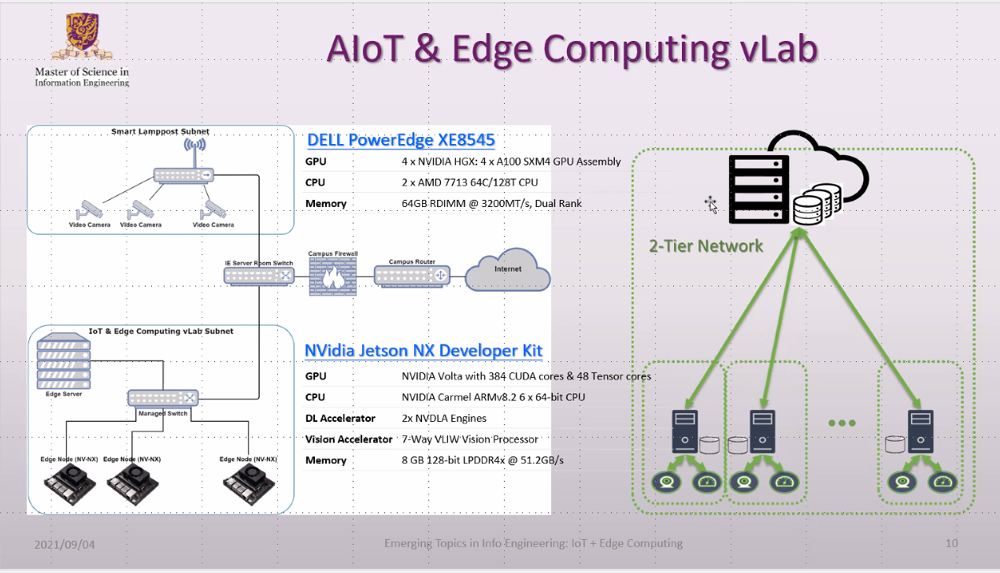
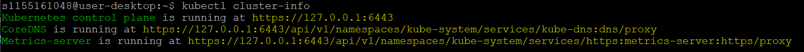
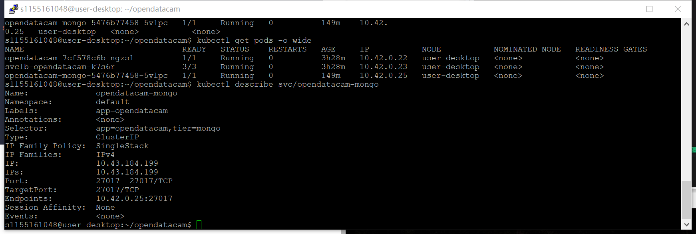
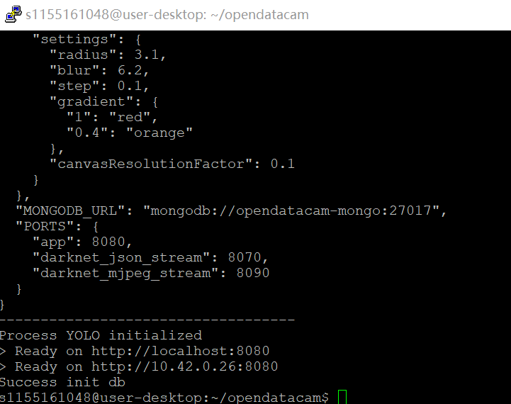

## Lab 4

### Architecture

1. Kubernetes cluster on server, send application from master machine to worker machines.
2. Edge server(Dell Power Edge XE8545, Cloud server - VM) + Edge node(Developer Kit).



### Use the VM

This server is where K8s cluster located.

```shell
sudo useradd xxxxxxxxxxxxx
sudo passwd xxxxxxxxxxxxx
sudo usermod -aG sudo xxxxxxxxxxx
```

#### Task 1: Install lightweight K8s to Xavier NX

Step1, Install k3s to NX, NX will become both the master and worker node, the following scripts is to check the architecture and information of cluster etc.

```shell
sudo chmod 777 /etc/rancher/k3s/k3s.yaml

sudo cp /etc/rancher/k3s/k3s.yaml ~/.kube
```

#### Task 2: Practice kubectl commands

```shell
kubectl get nodes -o wide
kubectl get pod -n kube-system  traefik-56c4b88c4b-xkzcr -o jsonpath='{.metadata.uid}'

# get the pod id
kubectl get pods -n <namespace> -o custom-columns=PodName:.metadata.name,PodUID:.metadata.uid
kubectl get pods -n kube-system -o custom-columns=PodName:.metadata.name,PodUID:.metadata.uid

# get into the container
kubectl get pods -A
kubectl exec -n kube-system -it traefik-56c4b88c4b-xkzcr -- /bin/sh

#check cluster information
kubectl cluster-info
# check the logs
kubectl -n kube-system logs -f traefik-56c4b88c4b-xkzcr
```



#### Task 3: Deploy Opendatacam Pod

##### Step1: Configure YOLOv4

Create folder and save `config.json`, configuration of opendatacam for YOLOv4.

```json
{
 "OPENDATACAM_VERSION": "3.0.2",
 "PATH_TO_YOLO_DARKNET" : "/var/local/darknet",
 "VIDEO_INPUT": "file",
 "NEURAL_NETWORK": "yolov4",
 "VIDEO_INPUTS_PARAMS": {
 "file": "opendatacam_videos/demo.mp4",
 "usbcam": "v4l2src device=/dev/video0 ! video/x-raw, framerate=30/1, width=640, height=360 ! videoconvert ! appsink",
 "raspberrycam": "nvarguscamerasrc ! video/x-raw(memory:NVMM),width=1280, height=720, framerate=30/1, format=NV12 ! nvvidconv ! video/x-raw, format=BGRx, width=640, height=360 ! videoconvert ! video/x-raw, format=BGR ! appsink",
 "remote_cam": "YOUR IP CAM STREAM (can be .m3u8, MJPEG ...), anything supported by opencv",
 "remote_hls_gstreamer": "souphttpsrc location=http://YOUR_HLSSTREAM_URL_HERE.m3u8 ! hlsdemux ! decodebin ! videoconvert ! videoscale ! appsink"
 },
 "TRACKER_SETTINGS": {
 "objectMaxAreaInPercentageOfFrame": 80,
 "confidence_threshold": 0.2,
 "iouLimit": 0.05,
 "unMatchedFrameTolerance": 5
 },
 "COUNTER_SETTINGS": {
 "minAngleWithCountingLineThreshold": 5,
 "computeTrajectoryBasedOnNbOfPastFrame": 5
 },
 "VALID_CLASSES": ["*"],
 "DISPLAY_CLASSES": [
 { "class": "bicycle", "hexcode": "1F6B2"},
 { "class": "person", "hexcode": "1F6B6"},
 { "class": "truck", "hexcode": "1F69B"},
 { "class": "motorbike", "hexcode": "1F6F5"},
 { "class": "car", "hexcode": "1F697"},
 { "class": "bus", "hexcode": "1F68C"}
 ],
 "PATHFINDER_COLORS": [
 "#1f77b4",
 "#ff7f0e",
 "#2ca02c",
 "#d62728",
 "#9467bd",
 "#8c564b",
 "#e377c2",
 "#7f7f7f",
 "#bcbd22",
 "#17becf"
 ],
 "COUNTER_COLORS": {
 "yellow": "#FFE700",
 "turquoise": "#A3FFF4",
 "green": "#a0f17f",
 "purple": "#d070f0",
 "red": "#AB4435"
 },
 "NEURAL_NETWORK_PARAMS": {
 "yolov4": {
 "data": "cfg/coco.data",
 "cfg": "cfg/yolov4-416x416.cfg",
 "weights": "yolov4.weights"
 },
 "yolov4-tiny": {
 "data": "cfg/coco.data",
 "cfg": "cfg/yolov4-tiny.cfg",
 "weights": "yolov4-tiny.weights"
 }
 },
 "TRACKER_ACCURACY_DISPLAY": {
 "nbFrameBuffer": 300,
 "settings": {
 "radius": 3.1,
 "blur": 6.2,
 "step": 0.1,
 "gradient": {
 "0.4":"orange",
 "1":"red"
 },
 "canvasResolutionFactor": 0.1
 }
 },
 "MONGODB_URL": "mongodb://opendatacam-mongo:27017",
 "PORTS": {
 "app": 8080,
 "darknet_json_stream": 8070,
 "darknet_mjpeg_stream": 8090
 }
}
```

For the MONGODB_URL, if the mongoDB service is not in the same namespace with opendatacam deployment, the URL should be specified.

```shell 
kubectl create configmap opendatacam --from-file=config.json --dry-run -o yaml | kubectl apply -f -
# check
kubectl get configmap
```

##### Step2: Create a K8s deployment for OpendataCam.

`opendatacam-deployment.yaml`

```yaml

apiVersion: apps/v1
kind: Deployment
metadata:
  labels:
    app: opendatacam
  name: opendatacam
spec:
  replicas: 1
  selector:
    matchLabels:
      app: opendatacam
      tier: frontend
  template:
    metadata:
      labels:
        app: opendatacam
        tier: frontend 
    spec:
      containers:
      - image: opendatacam/opendatacam:v3.0.2-xavier
        command: ["/bin/bash"]
        args: ["-c", "/var/local/opendatacam/launch.sh"]
        name: opendatacam
        ports:
        - containerPort: 8080
        - containerPort: 8070
        - containerPort: 8090
        resources: {}
        securityContext:
          privileged: true
        volumeMounts:
        - mountPath: /var/local/opendatacam/config.json
          name: opendatacam-config
          subPath: "config.json"
      restartPolicy: Always
      volumes:
      - name: opendatacam-config
        configMap:
          name: opendatacam
          items:
            - key: config.json
              path: config.json
```

Deploy the YAML setup and create pod.

```shell
kubectl apply -f opendatacam-deployment.yaml 
```

`opendatacam-service.yaml`

```yaml

apiVersion: v1
kind: Service
metadata:
  labels:
    app: opendatacam
  name: opendatacam
spec:
  ports:
  - name: "8070"
    port: 8070
    targetPort: 8070
  - name: "8090"
    port: 8090
    targetPort: 8090
  - name: "8080"
    port: 8080
    targetPort: 8080
  selector:
    app: opendatacam
    tier: frontend
  type: LoadBalancer
```

Apply the service and check if it's running.

```
kubectl apply -f opendatacam-service.yaml
kubectl get svc
kubectl describe svc opendatacam
```

Check if all the pods are running:

```shell
kubectl get pods
# if some pods is not running ,check the log to debug
kubectl logs <pods-name>
```

#### Task 4: Deploy MongoDB Pod

Deploy mongoDB

`opendatacam-mongo-pvc.yaml`

```yaml
apiVersion: v1
kind: PersistentVolumeClaim
metadata:
  name: mongodb-pv-claim
  labels:
    app: opendatacam
spec:
  accessModes:
  - ReadWriteOnce
  resources:
    requests:
      storage: 10Gi
```

```shell
kubectl apply -f opendatacam-mongo-pvc.yaml
kubectl get pvc
```

`opendatacam-mongo-deployment.yaml`

```yaml

apiVersion: apps/v1
kind: Deployment
metadata:
  labels:
    app: opendatacam
  name: opendatacam-mongo
spec:
  replicas: 1
  selector:
    matchLabels:
      app: opendatacam
      tier: mongo
  template:
    metadata:
      labels:
        app: opendatacam
        tier: mongo
    spec:
      containers:
      - image: mongo
        name: mongo
        ports:
        - containerPort: 27017
        resources: {}
        volumeMounts:
        - mountPath: /data/db
          name: mongodb-persistent-storage
      restartPolicy: Always
      volumes:
      - name: mongodb-persistent-storage
        persistentVolumeClaim:
          claimName: mongodb-pv-claim
```

`opendatacam-mongo-service.yaml`

```yaml

apiVersion: v1
kind: Service
metadata:
  labels:
    app: opendatacam
  name: opendatacam-mongo
spec:
  ports:
  - name: "27017"
    port: 27017
    targetPort: 27017
  selector:
    app: opendatacam
    tier: mongo
  type: ClusterIP
```



Then delete the opendatacam pod to force the k8s restart a new pod to refresh its setting for mongoDB, then the DB is successfully initiated.



#### Task 5: Access the OpendataCam Web UI

```
NAME                TYPE           CLUSTER-IP      EXTERNAL-IP     PORT(S)                                        AGE
kubernetes          ClusterIP      10.43.0.1       <none>          443/TCP                                        47h
opendatacam         LoadBalancer   10.43.127.12    192.168.85.67   8070:32541/TCP,8090:30191/TCP,8080:32588/TCP   3h38m
opendatacam-mongo   ClusterIP      10.43.184.199   <none>          27017/TCP                                      10m
```

Open: 192.168.85.67:32588, I can use the following command to check the logs.

```shell
kubectl logs -f <pod-name>
```


I set the counters at Lane Leftmost (red line), Lane Left1 (purple line), Lane Left (yellow line), Lane Middle (green line), Lane Right (blue line).

The counter result is as follow:

