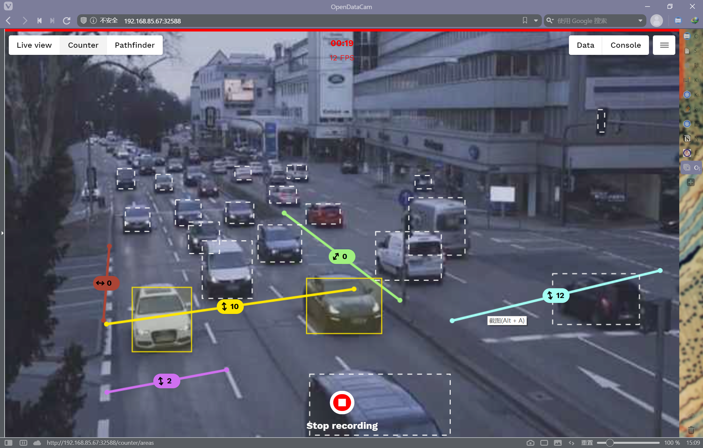
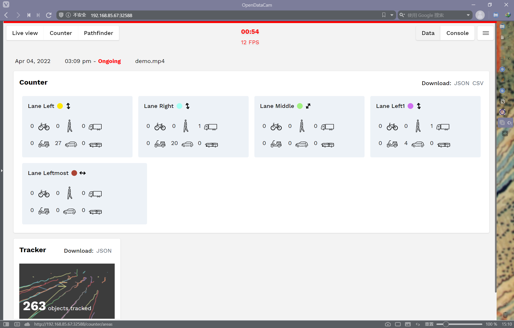

## Lab 4

### Architecture

1. Kubernetes cluster on server, send application from master machine to worker machines.
2. Edge server(Dell Power Edge XE8545, Cloud server - VM) + Edge node(Developer Kit).

Details should be hidden to project copyright.

Open: 192.168.85.67:32588, I can use the following command to check the logs.

```shell
kubectl logs -f <pod-name>
```



I set the counters at Lane Leftmost (red line), Lane Left1 (purple line), Lane Left (yellow line), Lane Middle (green line), Lane Right (blue line).

The counter result is as follow:

