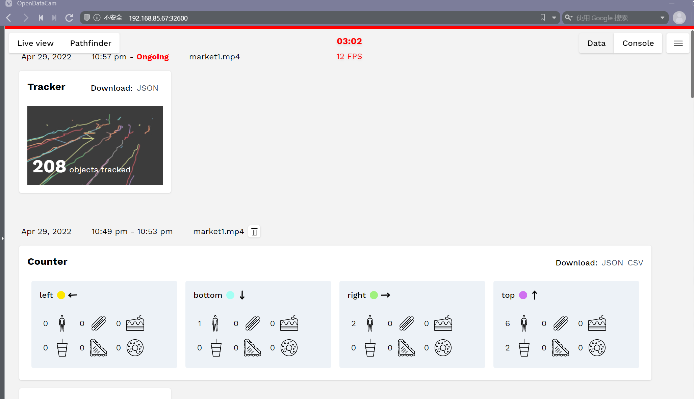
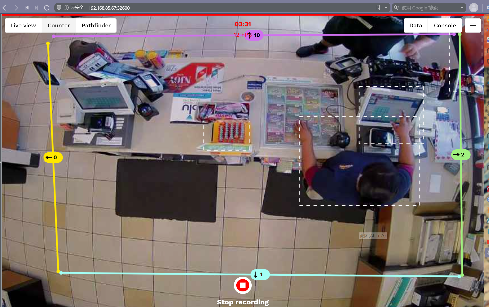
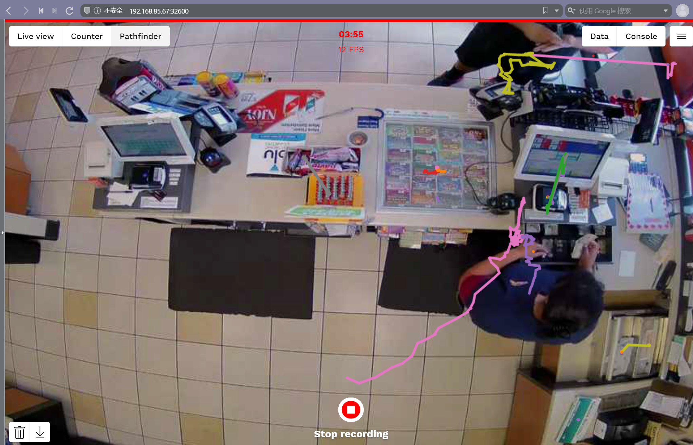
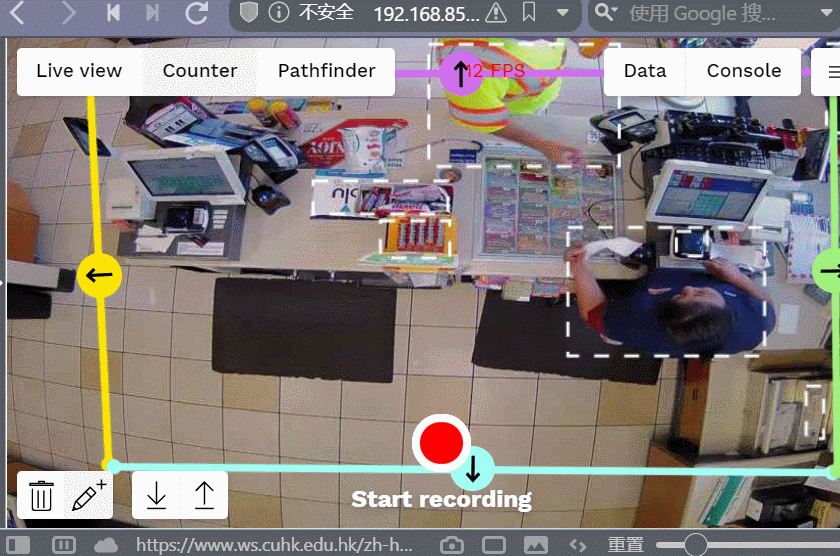
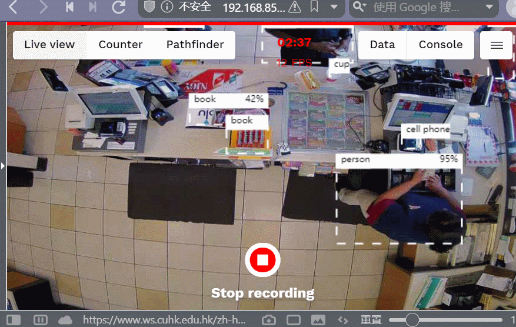
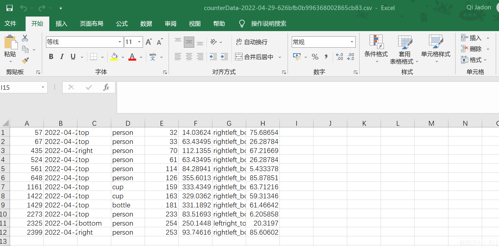

### Final Project

#### Step1 - Build container based on opendatacam [:link:](https://hub.docker.com/layers/opendatacam/opendatacam/opendatacam/v3.0.2-xavier/images/sha256-ccf5e813e80103548c4bf9e5447ebc9028838e9e4e981a4e7d87e37fce93273c?context=explore)

```dockerfile
FROM opendatacam/opendatacam:v3.0.2-xavier
COPY market1.mp4 /var/local/darknet/opendatacam_videos/market1.mp4
COPY market2.mp4 /var/local/darknet/opendatacam_videos/market2.mp4
CMD ./launch.sh
```

```shell
sudo docker build --tag market-detect:v1.7 .
sudo docker login
sudo docker tag market-detect:v1.7 jadenqi/market-detect:v1.7
sudo docker image push jadenqi/market-detect:v1.7
```

#### Step2 - Configure the opendatacam

```yaml
apiVersion: v1
data:
  config.json: |
    {
      "OPENDATACAM_VERSION": "3.0.2",
      "PATH_TO_YOLO_DARKNET" : "/var/local/darknet",
      "VIDEO_INPUT": "file",
      "NEURAL_NETWORK": "yolov4",
      "VIDEO_INPUTS_PARAMS": {
        "file": "opendatacam_videos/market1.mp4",
        "usbcam": "v4l2src device=/dev/video0 ! video/x-raw, framerate=30/1, width=640, height=360 ! videoconvert ! appsink",
        "raspberrycam": "nvarguscamerasrc ! video/xraw(memory:NVMM),width=1280, height=720, framerate=30/1, format=NV12 ! nvvidconv ! video/x-raw, format=BGRx, width=640, height=360 ! videoconvert ! video/x-raw, format=BGR ! appsink", "remote_cam": "YOUR IP CAM STREAM (can be .m3u8, MJPEG ...), anything supported by opencv",
        "remote_hls_gstreamer": "souphttpsrc location=http://YOUR_HLSSTREAM_URL_HERE.m3u8 ! hlsdemux ! decodebin ! videoconvert ! videoscale ! appsink"
      },
      "TRACKER_SETTINGS": {
        "objectMaxAreaInPercentageOfFrame": 80,
        "confidence_threshold": 0.2,
        "iouLimit": 0.05,
        "unMatchedFrameTolerance": 5
      },
      "COUNTER_SETTINGS": {
        "minAngleWithCountingLineThreshold": 5,
        "computeTrajectoryBasedOnNbOfPastFrame": 5
      },
      "VALID_CLASSES": ["*"],
      "DISPLAY_CLASSES": [
        { "class": "person", "hexcode": "1F9CD"},
        { "class": "hot dog", "hexcode": "1F32D"},
        { "class": "cake", "hexcode": "1F370"},
        { "class": "cup", "hexcode": "1F964"},
        { "class": "sandwich", "hexcode": "1F96A"},
        { "class": "donut", "hexcode": "1F369"}
      ],
      "PATHFINDER_COLORS": [
        "#1f77b4",
        "#ff7f0e",
        "#2ca02c",
        "#d62728",
        "#9467bd",
        "#8c564b",
        "#e377c2",
        "#7f7f7f",
        "#bcbd22",
        "#17becf"
      ],
      "COUNTER_COLORS": {
        "yellow": "#FFE700",
        "turquoise": "#A3FFF4",
        "green": "#a0f17f",
        "purple": "#d070f0",
        "red": "#AB4435"
      },
      "NEURAL_NETWORK_PARAMS": {
        "yolov4": {
          "data": "cfg/coco.data",
          "cfg": "cfg/yolov4-416x416.cfg",
          "weights": "yolov4.weights"
        },
        "yolov4-tiny": {
          "data": "cfg/coco.data",
          "cfg": "cfg/yolov4-tiny.cfg",
          "weights": "yolov4-tiny.weights"
        }
      },
      "TRACKER_ACCURACY_DISPLAY": {
        "nbFrameBuffer": 300,
        "settings": {
          "radius": 3.1,
          "blur": 6.2,
          "step": 0.1,
            "gradient": {
              "0.4":"orange",
              "1":"red"
            },
          "canvasResolutionFactor": 0.1
        }
      },
      "MONGODB_URL": "mongodb://opendatacam-mongo:27017",
      "PORTS": {
        "app": 8080,
        "darknet_json_stream": 8070,
        "darknet_mjpeg_stream": 8090
      }
    }
kind: ConfigMap
metadata:
  creationTimestamp: null
  name: opendatacam-market1
```

```shell
kubectl apply -f config.yaml
```

#### Step3 - YAML files

##### YAML file for OpendataCam

`opendatacam-deployment.yaml`

```yaml
apiVersion: apps/v1
kind: Deployment
metadata:
  labels:
    app: opendatacam
  name: opendatacam
spec:
  replicas: 1
  selector:
    matchLabels:
      app: opendatacam
      tier: frontend
  template:
    metadata:
      labels:
        app: opendatacam
        tier: frontend 
    spec:
      containers:
      - image: jadenqi/market-detect:v1.7
        command: ["/bin/bash"]
        args: ["-c", "/var/local/opendatacam/launch.sh"]
        name: opendatacam
        ports:
        - containerPort: 8080
        - containerPort: 8070
        - containerPort: 8090
        resources: {}
        securityContext:
          privileged: true
        volumeMounts:
        - mountPath: /var/local/opendatacam/config.json
          name: opendatacam-config
          subPath: "config.json"
      restartPolicy: Always
      volumes:
      - name: opendatacam-config
        configMap:
          name: opendatacam-market1
```

`opendatacam-service.yaml`

```yaml
apiVersion: v1
kind: Service
metadata:
  labels:
    app: opendatacam
  name: opendatacam
spec:
  ports:
  - name: "8070"
    port: 8070
    targetPort: 8070
  - name: "8090"
    port: 8090
    targetPort: 8090
  - name: "8080"
    port: 8080
    targetPort: 8080
  selector:
    app: opendatacam
    tier: frontend
  type: LoadBalancer
```

##### YAML file for mongoDB

`opendatacam-mongo-pvc.yaml`

```yaml
apiVersion: v1
kind: PersistentVolumeClaim
metadata:
  name: mongodb-pv-claim
  labels:
    app: opendatacam
spec:
  accessModes:
  - ReadWriteOnce
  resources:
    requests:
      storage: 10Gi
```

`opendatacam-mongo-deployment.yaml`

```yaml
apiVersion: apps/v1
kind: Deployment
metadata:
  labels:
    app: opendatacam
  name: opendatacam-mongo
spec:
  replicas: 1
  selector:
    matchLabels:
      app: opendatacam
      tier: mongo
  template:
    metadata:
      labels:
        app: opendatacam
        tier: mongo
    spec:
      containers:
      - image: mongo
        name: mongo
        ports:
        - containerPort: 27017
        resources: {}
        volumeMounts:
        - mountPath: /data/db
          name: mongodb-persistent-storage
      restartPolicy: Always
      volumes:
      - name: mongodb-persistent-storage
        persistentVolumeClaim:
          claimName: mongodb-pv-claim
```

`opendatacam-mongo-service.yaml`

```yaml
apiVersion: v1
kind: Service
metadata:
  labels:
    app: opendatacam
  name: opendatacam-mongo
spec:
  ports:
  - name: "27017"
    port: 27017
    targetPort: 27017
  selector:
    app: opendatacam
    tier: mongo
  type: ClusterIP
```

##### Deploy

`deployments.sh`

```
kubectl apply -f opendatacam-deployment.yaml
kubectl apply -f opendatacam-service.yaml
kubectl apply -f opendatacam-mongo-pvc.yaml
kubectl apply -f opendatacam-mongo-deployment.yaml
kubectl apply -f opendatacam-mongo-service.yaml
kubectl get svc
```

`stop-deployments.sh`

```
kubectl delete deployment opendatacam
kubectl delete deployment opendatacam-mongo
kubectl delete svc opendatacam
kubectl delete svc opendatacam-mongo
```











