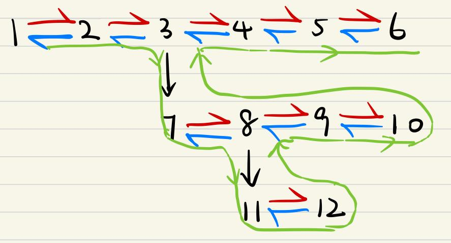
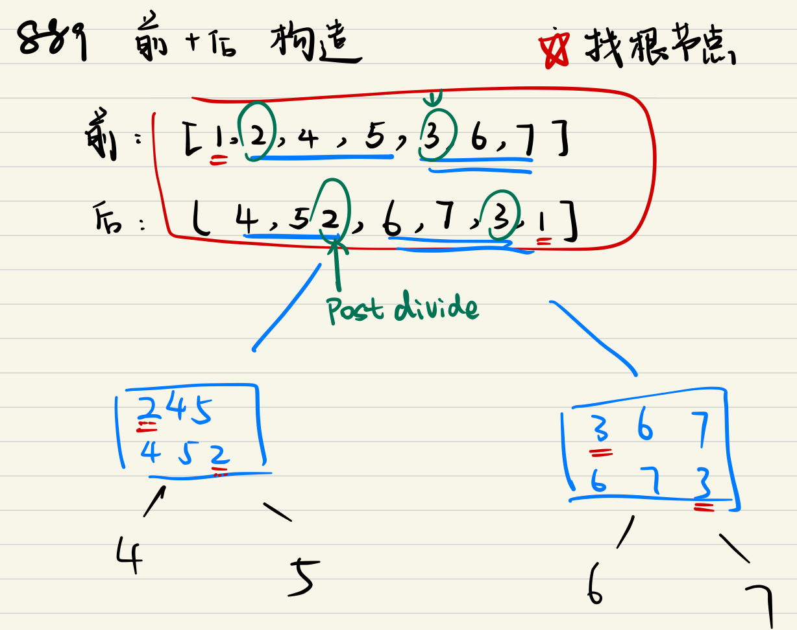

### 1.链表

#### 1.1单链表

##### [206] 反转链表

###### 1.迭代

```python
class Solution:
    def reverseList(self, head: ListNode) -> ListNode:
        # 使用迭代
        pre = head
        cur = None
        while pre != None:
        	# 保存Pre.next
            next = pre.next
            # 反转
            pre.next = cur
            cur = pre
            pre = next
        return cur
```

O(n)

###### 2.递归

```python
class Solution:
    def reverseList(self, head: ListNode) -> ListNode:
        # 使用递归
        # 这个列表长度小于等于1：
        if head == None or head.next == None:
            return head
        # 列表长度大于1
        new_head = self.reverseList(head.next)
        # 从head.next开始，head.next的下一个为head,并且new_head到最后一个
        head.next.next = head
        # head.next为None, head变成tail
        head.next = None
        return new_head

```

##### [92] 反转链表 II

###### Mistakes

```python
class Solution:
    def reverseBetween(self, head: ListNode, left: int, right: int) -> ListNode:
        pre = head
        cur = None
        count = 0
        if head.next = None:
            return head
        while pre != None:
            count = count + 1
            if count >= left and count <= right:
                next = pre.next
                pre.next = cur
                cur = pre
                pre = next
            else:
                cur = pre
                pre = pre.next
        return cur

```

```python
class Solution:
    def reverseBetween(self, head: ListNode, left: int, right: int) -> ListNode:
        if head.next is None:
            return head
        # 使用一个dummy指针，头指针推送到要反转的部分
        dummy = ListNode(-1)
        # 从head前开始
        dummy.next = head
        # 记录为pre，向前推
        pre = dummy.next
        cur = dummy
        # 推dummy指针
        for _ in range(left - 2):
            cur = pre
            pre = pre.next
        # 推到要反转的部分
        for _ in range(left-1, right-1):
            temp = pre.next
            pre.next = cur
            cur = pre
            pre = temp
        return cur

```

```python
class Solution:
    def reverseBetween(self, head: ListNode, left: int, right: int) -> ListNode:
        if head.next is None:
            return head
        # 使用一个dummy指针，头指针推送到要反转的部分
        dummy = ListNode(-1)
        # 从head前开始
        dummy.next = head
        # 记录为pre，向前推
        pre = dummy
        # 推dummy指针
        for _ in range(left - 1):
            pre = pre.next
        cur = pre.next
        # 推到要反转的部分
        for _ in range(right - left):
            temp = cur.next
            cur.next = temp.next
            temp.next = pre.next
            cur.next = temp
        return cur
```

###### 1.插头指针

```python
class Solution:
    def reverseBetween(self, head: ListNode, left: int, right: int) -> ListNode:
        if head.next is None:
            return head
        # 使用一个dummy指针，头指针推送到要反转的部分
        dummy = ListNode(-1)
        # 从head前开始
        dummy.next = head
        # 记录为pre，向前推
        pre = dummy
        # 推dummy指针
        for _ in range(left - 1):
            pre = pre.next
        cur = pre.next
        # 推到要反转的部分
        for _ in range(right - left):
            temp = cur.next
            cur.next = temp.next
            temp.next = pre.next
            pre.next = temp
        return dummy.next
```

###### 2.双指针-头插法 :+1:

Guard: g, point: p

g指针锁定反转开始的位置，将p后的(right - left)个node移动到g和p之间。

- g,p移动到相应位置
- p.next是待拆除的temp
- 将p与后面的节点连接
- temp代替g连接后面
- temp连接到g后面

```python
class Solution:
    def reverseBetween(self, head: ListNode, left: int, right: int) -> ListNode:
        if head.next is None:
            return head
        # 使用一个dummy指针，头指针推送到要反转的部分
        dummy = ListNode(-1)
        # 从head前开始
        dummy.next = head
        # 记录为pre，向前推
        g = dummy
        # 推dummy指针
        for _ in range(left - 1):
            g = g.next
        p = g.next
        # 推到要反转的部分
        for _ in range(right - left):
            temp = p.next
            p.next = p.next.next
            temp.next = g.next
            g.next = temp
        return dummy.next
```

##### [141] 循环链表

###### 1. 存入集合 / 哈希

Python中的set数据结构，元素是非重复的。

```python
class Solution:
    def hasCycle(self, head: Optional[ListNode]) -> bool:
        element_set = set()
        while head:
            if head in element_set:
                return True
            element_set.add(head)
            head = head.next
        return False
```

O(n) 时间，O(n) 空间

###### 2.快慢双指针:+1:

- 如果有环，快慢两个指针会相遇，因此不用使用哈希数据结构。

- fast = 2*slow 时，从头指针到入环点 = 相遇点到入环点

```python
class Solution:
    def hasCycle(self, head: Optional[ListNode]) -> bool:
        if head is None:
            return False
        fast, slow = head, head
        while fast != None:
            slow = slow.next
            if fast.next != None:
                fast = fast.next.next
            else: return False
            if fast == slow:
                return True
```

##### [142] 循环链表 II

###### 1.存入集合 / 哈希

```python
class Solution:
    def detectCycle(self, head: ListNode) -> ListNode:
        elements = set()
        while head:
            if head in elements:
                return head
            elements.add(head)
            head = head.next
        return None
```

###### 2.快慢双指针

- 如果有环，快慢两个指针会相遇，因此不用使用哈希数据结构。

- fast = 2*slow 时，从头指针到入环点 = 相遇点到入环点

  

  根据题意，任意时刻，$\textit{fast}$ 指针走过的距离都为 $\textit{slow}$ 指针的 22 倍。因此，我们有

  a+(n+1)b+nc=2(a+b) $\implies$ a=c+(n-1)(b+c)
  a+(n+1)b+nc=2(a+b)⟹a=c+(n−1)(b+c)

  有了 a=c+(n-1)(b+c)a=c+(n−1)(b+c) 的等量关系，我们会发现：从相遇点到入环点的距离加上 n-1圈的环长，恰好等于从链表头部到入环点的距离。

  因此，当发现 slow 与 fast 相遇时，我们再额外使用一个指针 ptr。起始，它指向链表头部；随后，它和 slow 每次向后移动一个位置。最终，它们会在入环点相遇。

  

```python
class Solution:
    def detectCycle(self, head: ListNode) -> ListNode:
        if head is None:
            return None
        # 从head 开始出发
        fast, slow = head, head
        while fast is not None:
            slow = slow.next
            if fast.next is not None:
                fast = fast.next.next
            else: return None
            if fast == slow:
                # 如果有相遇点，说明有环
                # a pointer start from head 来捕捉入环点
                pnt = head
                while pnt != slow:
                    pnt = pnt.next
                    slow = slow.next
                return pnt
        return None
```

##### [83] 删除重复元素

###### Mistakes

```python
class Solution:
    def deleteDuplicates(self, head: ListNode) -> ListNode:
        if head is None or head.next is None:
            return head
        pnt = head
        pnt2 = ListNode(-1)
        pnt2.next = head
        while pnt1 != None:
            if pnt1 == pnt2: # 我们需要比较链表的值
                pnt1 = pnt1.next.next
                pnt2 = pnt2.next.next
            else:
                pnt1 = pnt1.next
                pnt2 = pnt2.next
        return head
```

```python
class Solution:
    def deleteDuplicates(self, head: ListNode) -> ListNode:
        if head is None or head.next is None:
            return head
        pnt = head
        while pnt.next:
            if pnt.val == pnt.next.val:
                pnt = pnt.next.next # mistake
            else:
                pnt = pnt.next
        return head
```

###### Solution

```python
class Solution:
    def deleteDuplicates(self, head: ListNode) -> ListNode:
        if head is None or head.next is None:
            return head
        pnt = head
        while pnt.next:
            if pnt.val == pnt.next.val:
                pnt.next = pnt.next.next #指针跳转
            else:
                pnt = pnt.next
        return head
```

##### [82] 删除重复元素II

###### Mistake

```python
class Solution:
    def deleteDuplicates(self, head: ListNode) -> ListNode:
        if not head or not head.next:
            return head
        pnt1 = ListNode(-1)
        pnt1.next = head
        pnt2 = pnt1.next
        dummy = pnt1
        dummy.next = pnt1.next
        while pnt2.next:
            if pnt1.next.val == pnt2.next.val:
                while pnt2.val == pnt2.next.val:
                    pnt2 = pnt2.next
                pnt1.next = pnt2.next
                pnt2 = pnt2.next
            else:
                pnt1 = pnt1.next
                pnt2 = pnt2.next
        return head # what to return: dummy.next
```

###### Solution

双指针，pnt1在重复数据前等待，pnt2向前探索

```python
class Solution:
    def deleteDuplicates(self, head: ListNode) -> ListNode:
        if not head or not head.next:
            return head
        pnt1 = ListNode(-1)
        pnt1.next = head
        pnt2 = pnt1.next
        dummy = pnt1
        dummy.next = pnt1.next

        while pnt2 and pnt2.next:
            if pnt1.next.val == pnt2.next.val:
                while pnt2.next and pnt2.val == pnt2.next.val:
                    pnt2 = pnt2.next
                pnt1.next = pnt2.next
                pnt2 = pnt2.next
            else:
                pnt1 = pnt1.next
                pnt2 = pnt2.next
        return dummy.next
```

###### TODO:play_or_pause_button:：Better Solution

##to be continued##


##### [61] 旋转链表

###### 超时

```python
class Solution:
    def rotateRight(self, head: Optional[ListNode], k: int) -> Optional[ListNode]:
        if not head or not head.next or k < 1:
            return head
        # only two elements
        if not head.next.next:
            if k % 2 == 0:
                return head
            else:
                tail = head.next
                tail.next = head
                head.next = None
                return tail
        for _ in range(k):
            pnt = head
            dummy = ListNode(-1)
            dummy.next = head
            while pnt.next.next:
                pnt = pnt.next
            dummy.next = pnt.next
            pnt.next.next = head
            pnt.next = None
            head = dummy.next
        return dummy.next
```

可以模仿链表长度为2时，成环操作。

###### Mistake

旋转方向错误

```python
class Solution:
    def rotateRight(self, head: Optional[ListNode], k: int) -> Optional[ListNode]:
        if not head or not head.next or k < 1:
            return head
        tail, pnt = head, head
        count = 0
        while tail.next:
            tail = tail.next
            count = count + 1
        tail.next = head
        for _ in range(k):
            pnt = pnt.next
        pnt2 = pnt
        for _ in range(count):
            pnt2 = pnt2.next
        pnt2.next = None
        return pnt
```

###### Solution

```python
class Solution:
    def rotateRight(self, head: Optional[ListNode], k: int) -> Optional[ListNode]:
        if not head or not head.next or k < 1:
            return head
        pnt, tail = head, head
        count = 1
        while tail.next:
            tail = tail.next
            count = count + 1
        tail.next = head
        print(count)
        for _ in range(count - 1 - k % count):
            pnt = pnt.next
        result = pnt.next
        pnt.next = None
        return result
```

1.正确计算count, 初始化count = 1 而不是0

2.找到想要切割的位置和移动次数的关系 count -1 - k mod count

##### [234] 回文链表

###### 1.存储到数组中

O(n), O(n). 将链表存到数组里面进行验证。

```python
class Solution:
    def isPalindrome(self, head: ListNode) -> bool:
        if not head.next:
            return True
        pnt = head
        list = []
        while pnt:
            list.append(pnt.val)
            pnt = pnt.next
        return list == lst[::-1]
```

###### 2.快慢指针

1. fast = 2 * slow, fast走到链表尾部时，slow走到中间
2. slow停在中间，反转后面部分的链表
3. pnt从head开始，slow从中间同时出发，验证是否一致

```python
class Solution:
    def isPalindrome(self, head: ListNode) -> bool:
        if not head.next:
            return True
        if not head.next.next:
            if head.val == head.next.val:
                return True
            else: return False
        fast, slow, pnt2 = head, head, head
        while fast and fast.next:
            fast = fast.next.next
            slow = slow.next
        pnt1 = slow
        # 反转后半部分
        pnt1 = self.reverseList(pnt1)
        while pnt1:
            if pnt1.val != pnt2.val:
                return False
            pnt1 = pnt1.next
            pnt2 = pnt2.next
        return True
    def reverseList(self, head: ListNode) -> ListNode:
        # 使用迭代
        pre = head
        cur = None
        while pre != None:
            # 保存Pre.next
            next = pre.next
            # 反转
            pre.next = cur
            cur = pre
            pre = next
        return cur
```

##### [143] 重排链表:+1:

1.找到**链表中点**

2.**反转**右半部分链表

3.元素依次**merge**两个链表

###### Mistake

对偶数个输入time limit exceeded, 对奇数个输入正确。

中点的计算问题：fast,slow双指针结束时while判断条件/反转开始的节点选择(pnt1)。

```python
class Solution:
    def reorderList(self, head: ListNode) -> None:
        """
        Do not return anything, modify head in-place instead.
        """
        if head or head.next:
            fast, slow = head, head
            while fast and fast.next: # IMPORTANT
                fast = fast.next.next
                slow = slow.next
            # middle point of the list

            pnt1 = slow

            # reverse the right half part of list
            pnt1 = self.reverseList(pnt1)
            print('pnt1:', pnt1)
            self.mergeList(head, pnt1)
    # reverse the list
    def reverseList(self, head: ListNode) -> ListNode:
        # 使用迭代
        pre = head
        cur = None
        while pre != None:
            # 保存Pre.next
            next = pre.next
            # 反转
            pre.next = cur
            cur = pre
            pre = next
        return cur
    # merge the 2 list in one by one manner
    def mergeList(self, l1:ListNode, l2:ListNode):
        while l1 and l2:
            temp1, temp2 = l1.next, l2.next

            l1.next = l2
            l1 = temp1

            l2.next = l1
            l2 = temp2
```

###### Solution

```python
class Solution:
    def reorderList(self, head: ListNode) -> None:
        """
        Do not return anything, modify head in-place instead.
        """
        if head or head.next:
            fast, slow = head, head
            while fast.next and fast.next.next:
                fast = fast.next.next
                slow = slow.next
            # middle point of the list
            pnt1 = slow
            # reverse the right half part of list
            pnt1 = self.reverseList(pnt1)
            self.mergeList(head, pnt1)
    # reverse the list
    def reverseList(self, head: ListNode) -> ListNode:
        # 使用迭代
        pre = head
        cur = None
        while pre != None:
            # 保存Pre.next
            next = pre.next
            # 反转
            pre.next = cur
            cur = pre
            pre = next
        return cur
    # merge the 2 list in one by one manner
    def mergeList(self, l1:ListNode, l2:ListNode):
        while l1 and l2:
            temp1, temp2 = l1.next, l2.next

            l1.next = l2
            l1 = temp1

            l2.next = l1
            l2 = temp2
```

##### [203] 移除链表元素

###### 1.两个指针

利用两个指针在处理全相等的链表时并不优雅

```python
class Solution:
    def removeElements(self, head: ListNode, val: int) -> ListNode:
        dummy = ListNode(-1)
        dummy.next = head
        pre = dummy
        while head:
            print('pre:', pre.val)
            print('head:',head.val)
            # 判断节点数值
            if head.val == val:
                while head and head.next.val == val:
                	head = head.next
                pre.next = head.next
            # 最后一个元素
            if head is None:
                return dummy.next
            # move on the 2 points
            head = head.next
            pre = pre.next
        return dummy.next
```

###### 2.一个指针

```python
class Solution:
    def removeElements(self, head: ListNode, val: int) -> ListNode:
        dummy = pnt = ListNode(-1)
        dummy.next = head
        pnt.next = head
        while pnt.next:
            if pnt.next.val == val:
                pnt.next = pnt.next.next
            else:
                pnt = pnt.next
        return dummy.next
```

##### [19] 删除链表的倒数第N个节点

###### 1.反转链表

1.反转过来

2.删除

3.翻回去

```python
class Solution:
    def removeNthFromEnd(self, head: ListNode, n: int) -> ListNode:
        if not head.next:
            if n == 1:
                return None
            else: return head
        new_head = self.reverseList(head)
        dummy = ListNode(-1)
        dummy.next = new_head
        pnt = dummy
        for _ in range(n-1):
            pnt = pnt.next

        print('pnt:',pnt.val)
        pnt.next = pnt.next.next
        return self.reverseList(dummy.next)

    def reverseList(self, head: ListNode) -> ListNode:
        # 使用迭代
        pre = head
        cur = None
        while pre != None:
            # 保存Pre.next
            next = pre.next
            # 反转
            pre.next = cur
            cur = pre
            pre = next
        return cur
```

###### 2.数出要移除的位置

需要对链表遍历两次：第一次得到总长度L，第二次移除L-n

```python
class Solution:
    def removeNthFromEnd(self, head: ListNode, n: int) -> ListNode:
        count = 0
        pnt = head
        while pnt:
            pnt = pnt.next
            count = count + 1
        dummy = ListNode(-1)
        dummy.next = head
        pnt = dummy
        for _ in range(count - n):
            pnt = pnt.next
        pnt.next = pnt.next.next
        return dummy.next
```

###### 比较

方法速度差不多

##### [237] 删除链表中的节点

不能回溯上一个节点进行连接，但可以将下一个节点的值赋值给当前元素。

```python
class Solution:
    def deleteNode(self, node):
        """
        :type node: ListNode
        :rtype: void Do not return anything, modify node in-place instead.
        """
        node.val = node.next.val
        node.next = node.next.next
```

##### [148] 排序链表

###### Mistake

根据链表中的值升序排序

```python
class Solution:
    def sortList(self, head: Optional[ListNode]) -> Optional[ListNode]:
        if not head or head.next:  # 应该是 not head.next
            return head

        dummy = ListNode(-1)
        dummy.next = head
        pnt1 = dummy.next
        pnt2 = head.next
        while pnt1.next:
            while pnt2:
                if pnt2.val < pnt1.val:
                    temp = pnt2.val
                    pnt2.val = pnt1.val
                    pnt1.val = temp
                pnt2 = pnt2.next
            pnt1 = pnt1.next
            pnt2 = pnt1.next

        return dummy.next
```

双指针，交换。

###### Time Limit Exceed

```python
class Solution:
    def sortList(self, head: Optional[ListNode]) -> Optional[ListNode]:
        if not head or not head.next: 
            return head

        dummy = ListNode(-1)
        dummy.next = head
        pnt1 = dummy.next
        pnt2 = head.next
        while pnt1.next:
            while pnt2:
                if pnt2.val < pnt1.val:
                    temp = pnt2.val
                    pnt2.val = pnt1.val
                    pnt1.val = temp
                pnt2 = pnt2.next
            pnt1 = pnt1.next
            pnt2 = pnt1.next

        return dummy.next
```

###### Solution： 归并排序 :+1:


- Goal :goal_net:: $O(n·logn)$ in time, Constant in memory

- Mistake: 超出最多递归次数。

```python
class Solution:
    def sortList(self, head: Optional[ListNode]) -> Optional[ListNode]:
        if not head or not head.next:
            return head
        # 分: left and right
        mid = self.midNode(head)
            # 2 nodes only condition
        if not mid.next:
            return mid
        #########################################
        left = self.sortList(head)
        right = self.sortList(mid.next)
        mid.next = None
        #########################################
        # 合
        return self.mergeSort(left, right)
    # 分
    def midNode(self, head: ListNode) -> ListNode:
        pnt = ListNode(-1, head)
        slow, fast = pnt, pnt
        while fast and fast.next:
            slow = slow.next
            fast = fast.next.next
        return slow
    # 治之
    def mergeSort(self, left: ListNode, right: ListNode) -> ListNode:
        new_head = dummy = ListNode(-1)
        while left and right:
            # 治： if left is smaller in value, put on the left side
            if left.val < right.val:
                new_head.next = left
                left = left.next
            else:
                new_head.next = right
                right = right.next
            # add new nodes to the new head
            new_head = new_head.next
            # print('||left||:', left, '||right||:', right, '||new_head||:',new_head)
        new_head.next = left if left else right
        return dummy.next
```

- Solution

  前半部分要记得cut.

```python
class Solution:
    def sortList(self, head: Optional[ListNode]) -> Optional[ListNode]:
        if not head or not head.next:
            return head
        # 分: left and right
        mid = self.midNode(head)
            # 2 nodes only condition
        if not mid.next:
            return mid
        #########################################
        right = self.sortList(mid.next)
        mid.next = None
        left = self.sortList(head)
        #########################################
        # 合
        return self.mergeSort(left, right)
    # 分
    def midNode(self, head: ListNode) -> ListNode:
        pnt = ListNode(-1, head)
        slow, fast = pnt, pnt
        while fast and fast.next:
            slow = slow.next
            fast = fast.next.next
        return slow
    # 治之
    def mergeSort(self, left: ListNode, right: ListNode) -> ListNode:
        new_head = pnt = ListNode(-1)
        while left and right:
            # 治： if left is smaller in value, put on the left side
            if left.val < right.val:
                new_head.next = left
                left = left.next
            else:
                new_head.next = right
                right = right.next
            # add new nodes to the new head
            new_head = new_head.next

        new_head.next = left if left else right
        return pnt.next

```

- Details

  ```
  测试用例:[4,2,3,1,5,8,7]
  测试结果:[1,2,3,4,5,7,8]
  期望结果:[1,2,3,4,5,7,8]
  ```


###### Insights: 排序算法总结 :bookmark:

###### TODO:play_or_pause_button::排序算法的实现与分析

| **排序算法**     | **平均时间复杂度** | **最坏时间复杂度** | **最好时间复杂度** | **空间复杂度** | **稳定性** |
| ---------------- | ------------------ | ------------------ | ------------------ | -------------- | ---------- |
| **冒泡排序**     | O(n²)              | O(n²)              | O(n)               | O(1)           | 稳定       |
| **直接选择排序** | O(n²)              | O(n²)              | O(n)               | O(1)           | 不稳定     |
| **直接插入排序** | O(n²)              | O(n²)              | O(n)               | O(1)           | 稳定       |
| **快速排序**     | O(nlogn)           | O(n²)              | O(nlogn)           | O(nlogn)       | 不稳定     |
| **堆排序**       | O(nlogn)           | O(nlogn)           | O(nlogn)           | O(1)           | 不稳定     |
| **希尔排序**     | O(nlogn)           | O(ns)              | O(n)               | O(1)           | 不稳定     |
| **归并排序**     | O(nlogn)           | O(nlogn)           | O(nlogn)           | O(n)           | 稳定       |
| **计数排序**     | O(n+k)             | O(n+k)             | O(n+k)             | O(n+k)         | 稳定       |
| **基数排序**     | O(N*M)             | O(N*M)             | O(N*M)             | O(M)           | 稳定       |

https://blog.csdn.net/pange1991/article/details/85460755

##### [876] 链表的中间节点

###### 常用:bookmark:

得到中点往后半部分

```python
class Solution:
    def middleNode(self, head: ListNode) -> ListNode:
        fast = slow = head
        while fast and fast.next:
            fast = fast.next.next
            slow = slow.next
        return slow
```

得到中点前半部分

```python
class Solution:
    def middleNode(self, head: ListNode) -> ListNode:
        if not head or not head.next:
            return head
        fast = slow = head

        while fast and fast.next:
            pre = slow
            fast = fast.next.next
            slow = slow.next
        pre.next = None
        return head
```


##### [86] 分隔链表

###### Solution

等效化问题： 等于把数按x分为两份，小于x一份，大于x一份，最后拼接。

###### Mistake

有的Large链表尾部和其他元素相连，需要记得cut，否则会连接回去形成闭环循环。

###### 无限循环错误:o:

```python
class Solution:
    def partition(self, head: ListNode, x: int) -> ListNode:
        if not head or not head.next:
            return head
        small = ListNode(-1)
        large = ListNode(-1)
        small_dummy = small
        large_dummy = large
        while head:
            if head.val < x:
                small.next = head
                small = small.next
            else:
                large.next = head
                large = large.next
            head = head.next
        large.next = None #######容易忘记，造成超时#######
        small.next = large_dummy.next
        return small_dummy.next  
```

##### [147] 对链表进行插入排序

###### 排序算法recap:bookmark:

```python
class Solution:
    def insertionSortList(self, head: ListNode) -> ListNode:
        if not head or not head.next:
            return head

        dummy = ListNode(-1, head)
        sorted = head
        curr = sorted.next
        while curr:
            if curr.val >= sorted.val:
                sorted = sorted.next
            else:
                # move prev 用来定位插入的位置
                prev = dummy
                while prev.next.val <= curr.val:
                    prev = prev.next
                temp1 = prev.next
                temp2 = curr.next
                prev.next = curr
                curr.next = temp1
                sorted.next = temp2
            curr = sorted.next
        return dummy.next
```

##### [138] 复制带随机指针的链表

###### Mistake

Node with label 7 was not copied but a reference to the original one.

```python
class Solution:
    def copyRandomList(self, head: 'Optional[Node]') -> 'Optional[Node]':
        if not head or not head.next:
            return head
        pnt = head
        index_list = []
        while pnt:
            index_list.append(pnt.random)
            pnt = pnt.next
        dummy = ListNode(-1)
        dummy.next = head
        count = 0
        while pnt:
            pnt.random = index_list[count]
            pnt = pnt.next
        return dummy.next
```

与之前题目声明了ListNode不同，题目中每个为Node.

###### 1.后方插入新Node

每个原指针后面插入新的node，方便构建新的random指针，然后拆除旧的next指针

```python
class Solution:
    def copyRandomList(self, head: 'Optional[Node]') -> 'Optional[Node]':
        if not head:
            return head
        pnt = head
        while pnt:
            new_node = Node(pnt.val, pnt.next,None) # leave Node.random
            pnt.next = new_node # connect
            pnt = new_node.next # move on
        # new connection: random 完成random连接构建
        pnt = head
        while pnt:
            if pnt.random:
                pnt.next.random = pnt.random.next
            pnt = pnt.next.next

        # print('head:', head.val, 'head.next:', head.next.val)
        dummy = Node(-1, head, None)
        cur = dummy
        pnt = head
        # 解除原本的next连接，构建新的next连接
        while pnt:
            cur.next = pnt.next
            pnt = pnt.next.next
            cur = cur.next
        return dummy.next
```

###### 2.哈希表:+1:

###### TODO:play_or_pause_button:

##### [24] 两两交换节点

###### Mistake

只使用两个指针容易造成指针指向混淆，成环而无限循环

###### 无限循环错误:o:

```python
class Solution:
    def swapPairs(self, head: ListNode) -> ListNode:
        if not head or not head.next:
            return head
        dummy = ListNode(-1,head)
        cur = dummy
        pre = head.next
        print('cur:', cur.val, 'pre:',pre.val)
        while pre.next:
            cur.next.next = pre.next
            pre.next = cur.next
            cur.next = pre
            cur = cur.next.next
            pre = pre.next.next
            print('cur:', cur.val, 'pre:',pre.val)
        return dummy.next
```

###### Solution

用一个指针推进，在while循环时设置两个指针调整位置。

```python
class Solution:
    def swapPairs(self, head: ListNode) -> ListNode:
        dummy = ListNode(0)
        dummy.next = head
        temp = dummy
        while temp.next and temp.next.next:
            cur = temp.next
            pre = temp.next.next
            temp.next = pre
            cur.next = pre.next
            pre.next = cur
            temp = cur
        return dummy.next
```


##### [707] 设计链表

###### Problem

内存使用很少，但是速度太慢。

```python
class ListNode:

    def __init__(self, val=0, next=None):
        self.val = val
        self.next = next

class MyLinkedList:

    def __init__(self):
        self.size = 0
        self.head = ListNode(0)

    def get(self, index: int) -> int:
        if (self.size - 1) < index or index < 0:
            return -1
        count = 0
        pnt = self.head
        while pnt:
            if count == index:
                return pnt.next.val
            pnt = pnt.next
            count = count + 1

    def addAtHead(self, val: int) -> None:
        new_node = ListNode(val)
        temp = self.head.next
        self.head.next = new_node
        new_node.next = temp
        self.size += 1

    def addAtTail(self, val: int) -> None:
        new_node = ListNode(val)
        temp = self.head
        while temp.next:
            temp = temp.next
        temp.next = new_node
        new_node.next = None
        self.size += 1

    def addAtIndex(self, index: int, val: int) -> None:
        new_node = ListNode(val)
        pnt = self.head
        count = 0
        print('size is: ',self.size)
        if index < 0:
            self.addAtHead(val)
        if index >= 0 and index < self.size:
            while pnt:
                if count == index:
                    temp = pnt.next
                    pnt.next = new_node
                    new_node.next = temp
                pnt = pnt.next
                count = count + 1
            self.size += 1
        if index == self.size:
            self.addAtTail(val)

    def deleteAtIndex(self, index: int) -> None:
        pnt = self.head
        count = 0
        if index >= 0 and index < self.size:
            while pnt:
                if count == index:
                    pnt.next = pnt.next.next
                    self.size -= 1
                count = count + 1
                pnt = pnt.next
```

##### [328] 奇偶链表

###### Mistake

```python
class Solution:
    def oddEvenList(self, head: ListNode) -> ListNode:
        if not head or not head.next:
            return head
        pnt = head
        odd = ListNode(-1, head)
        even = ListNode(-1, head)
        odd_dummy = odd
        even_dummy = even
        while pnt and pnt.next:
            odd.next = pnt
            even.next = pnt.next
            odd = odd.next
            even = even.next
            pnt = pnt.next.next
        even.next = None
        odd.next = even_dummy.next
        return odd_dummy.next
```

###### TODO:play_or_pause_button:

错过了最后一个元素，如何修改？

###### Solution

```python
class Solution:
    def oddEvenList(self, head: ListNode) -> ListNode:
        if not head or not head.next:
            return head
        odd = head
        evenHead = head.next
        even = evenHead
        while even and even.next:
            odd.next = even.next
            odd = odd.next
            even.next = odd.next
            even = even.next
        odd.next = evenHead
        return head
```

##### [109] 有序链表转二叉树

###### Key

平衡二叉树是中点问题，见 [876] 题，正确找到中点的左侧部分是关键。

###### Mistake

```python
class Solution:
    def sortedListToBST(self, head: Optional[ListNode]) -> Optional[TreeNode]:
        if not head or not head.next:
            return head
        left = right = ListNode(-1, head)
        fast = slow = head
        while fast and fast.next:
            left = slow
            slow = slow.next
            fast = fast.next.next
        print('mid:', slow.val)
        root = TreeNode(slow.val)
        right.next = slow.next
        print('left:', left)
        print('right:', right)
        if left:
            left.next = None
            print('left:', left)
            root.left = self.sortedListToBST(left.next)
        root.right = self.sortedListToBST(right.next)
        return root
```

###### Solution

中点左侧部分，用slowHead标记。

```python
class Solution:
    def sortedListToBST(self, head: ListNode) -> TreeNode:
        if not head:
            return head
        slow = fast = head
        slowHead = None
        while fast and fast.next:
            slowHead = slow
            fast = fast.next.next
            slow = slow.next
        root = TreeNode(slow.val)

        if slowHead:
            slowHead.next = None
            root.left = self.sortedListToBST(head)
        root.right = self.sortedListToBST(slow.next)
        return root
```

##### [430] 扁平化多级双向链表

```python
class Solution:
    def flatten(self, head: 'Node') -> 'Node':
        cur = head
        while cur:
            if cur.child:
                # flw 是分支的部分
                flw = cur.next
                child = cur.child
                cur.next = child
                child.prev = cur
                cur.child = None
                while child.next:
                    child = child.next
                if flw:
                    flw.prev = child
                    child.next = flw
            cur = cur.next
        return head
```



##### [725] 分隔K个链表

```python
class Solution:
    def splitListToParts(self, head: ListNode, k: int) -> List[ListNode]:
        if not head:
            return [None for _ in range(k)]
        # 设计分隔子链表的长度
        pnt = head
        list = []
        while pnt:
            list.append(pnt.val)
            pnt = pnt.next
        sub_len = [len(list) // k for _ in range(k)]
        add1 = len(list) % k
        for i in range(add1):
            sub_len[i] = sub_len[i] + 1
        # 按照长度存储链表
        pnt = head
        output = [None for _ in range(k)]
        i = 0
        while i < k and pnt:
            # 子链表的长度
            sub_len_num = sub_len[i]
            output[i] = pnt # 起点
            for _ in range(sub_len_num-1): #截取
                pnt = pnt.next
            temp = pnt.next # 记录尾部
            pnt.next = None # 截取
            pnt = temp # 尾部恢复继续前进
            i = i + 1
        return output
```

##### [25] K个一组翻转链表

速度比较慢(57%),使用内存较大。

```python
class Solution:
    def reverseKGroup(self, head: Optional[ListNode], k: int) -> Optional[ListNode]:
        if not head or not head.next:
            return head
        pnt = head
        link_list_len = 0
        while pnt:
            pnt = pnt.next
            link_list_len = link_list_len + 1

        group_num = link_list_len // k
        # 不能整除的情况
        if (link_list_len % k):
            group_num = group_num + 1
        pnt = head
        output = [None for _ in range(group_num)]
        i = 0
        # 分别翻转
        while i < (group_num-1) and pnt.next:
            output[i] = pnt
            for _ in range(k-1):
                pnt = pnt.next
            temp = pnt.next
            pnt.next = None
            pnt = temp
            output[i] = self.reverseList(output[i])
            i = i + 1
        # 最后一部分是否需要反转
        if (link_list_len % k):
            output[i] = pnt
            while pnt:
                pnt = pnt.next
        else:
            output[i] = pnt
            while pnt:
                pnt = pnt.next
            output[i] = self.reverseList(output[i])
        # 拼接
        for i in range(group_num-1):
            pnt = output[i]
            while pnt.next:
                pnt = pnt.next
            pnt.next = output[i+1]
        res = output[0]
        return res

    def reverseList(self, head: ListNode) -> Optional[ListNode]:
        # 使用迭代
        pre = head
        cur = None
        while pre != None:
            next = pre.next
            pre.next = cur
            cur = pre
            pre = next
        return cur
```

###### Better Solution :+1:

###### TODO::play_or_pause_button:

#### 1.2 双链表

##### [21] 合并两个有序链表

```python
class Solution:
    def mergeTwoLists(self, list1: Optional[ListNode], list2: Optional[ListNode]) -> Optional[ListNode]:
        if not list1 or not list2:
            if list1:
                return list1
            elif list2:
                return list2
            return list1

        pnt1, pnt2 = list1, list2
        pnt3 = ListNode(-1)
        res = ListNode(-1,pnt3)

        while pnt1 and pnt2:
            if pnt1.val <= pnt2.val:
                pnt3.next = pnt1
                pnt3 = pnt3.next
                pnt1 = pnt1.next
            else:
                pnt3.next = pnt2
                pnt3 = pnt3.next
                pnt2 = pnt2.next
                
       # 剩余部分不需要再遍历，直接指向头部就可以。
        if pnt1:
            while pnt1:
                pnt3.next = pnt1
                pnt3 = pnt3.next
                pnt1 = pnt1.next
        elif pnt2:
            while pnt2:
                pnt3.next = pnt2
                pnt3 = pnt3.next
                pnt2 = pnt2.next
        return res.next.next
```

###### Better Solution

```python
class Solution:
    def mergeTwoLists(self, list1: Optional[ListNode], list2: Optional[ListNode]) -> Optional[ListNode]:
        if not list1 or not list2:
            if list1:
                return list1
            elif list2:
                return list2
            return list1

        pnt1, pnt2 = list1, list2
        res = pnt3 = ListNode(-1)

        while pnt1 and pnt2:
            if pnt1.val <= pnt2.val:
                pnt3.next = pnt1
                pnt1 = pnt1.next
            else:
                pnt3.next = pnt2
                pnt2 = pnt2.next
            pnt3 = pnt3.next

        pnt3.next = pnt1 if pnt1 else pnt2

        return res.next
```

##### [160] 相交链表

###### 相同路程

Idea：令两个指针在两个链表上行走，一定会在某一点重合（路程相同的时候）。如果相交，则会在pntA == pntB判断中被发现，如果不相交，返回None.

```python
class Solution:
    def getIntersectionNode(self, headA: ListNode, headB: ListNode) -> ListNode:
        pntA = headA
        pntB = headB
        while pntA != pntB:
            pntA = pntA.next if pntA else headB
            pntB = pntB.next if pntB else headA
        return pntB
```

##### [2] 两数相加

```python
class Solution:
    def addTwoNumbers(self, l1: ListNode, l2: ListNode) -> ListNode:
        list1 = []
        list2 = []
        while l1:
            list1.append(l1.val)
            l1 = l1.next
        while l2:
            list2.append(l2.val)
            l2 = l2.next
        return self.retriveToLink(self.calculate(list1,list2))

    def calculate(self, list1:list, list2:list) -> int:
        list1_num = 0
        list2_num = 0
        for i in range(len(list1)):
            list1_num = list1_num + list1[i] * (10 ** i)
        for i in range(len(list2)):
            list2_num = list2_num + list2[i] * (10 ** i)
        return list1_num + list2_num

    def retriveToLink(self, sum_int: int) -> ListNode:
        res = l3 = ListNode(-1)
        pow = 0
        if sum_int == 0:
            l3.next = ListNode(0)
            l3 = l3.next
        while sum_int != 0:
            val = sum_int % 10
            sum_int = sum_int // 10
            l3.next = ListNode(val)
            l3 = l3.next
        return res.next
```

##### [445] 两数相加 II

```python
class Solution:
    def addTwoNumbers(self, l1: ListNode, l2: ListNode) -> ListNode:
        list1 = []
        list2 = []
        while l1:
            list1.append(l1.val)
            l1 = l1.next
        while l2:
            list2.append(l2.val)
            l2 = l2.next
        return self.retriveToLink(self.calculate(list1, list2))

    def calculate(self, list1: list, list2: list) -> int:
        list1_num = 0
        list2_num = 0
        for i in range(len(list1)):
            list1_num = list1_num + list1[i] * (10 ** (len(list1) - i - 1))
        for i in range(len(list2)):
            list2_num = list2_num + list2[i] * (10 ** (len(list2) - i - 1))

        print(list1_num, list2_num)
        return list1_num + list2_num

    def retriveToLink(self, sum_int: int) -> ListNode:
        res = l3 = ListNode(-1)
        if sum_int == 0:
            l3.next = ListNode(0)
            l3 = l3.next
        vals = []
        while sum_int != 0:
            val = sum_int % 10
            sum_int = sum_int // 10
            vals.append(val)
        for i in range(len(vals)):
            val = vals[len(vals) - i - 1]
            l3.next = ListNode(val)
            l3 = l3.next
        return res.next
```

##### [1669] 合并两个链表

```python
class Solution:
    def mergeInBetween(self, list1: ListNode, a: int, b: int, list2: ListNode) -> ListNode:
        pnt1 = list1
        count = 0
        # 拆除
        while pnt1:
            if count+1 == a:
                start = pnt1
                for _ in range(b-a+1):
                    pnt1 = pnt1.next
                end = pnt1.next
                break
            count = count + 1
            pnt1 = pnt1.next
        # 安装

        pnt2 = list2
        while pnt2.next:
            pnt2 = pnt2.next
        start.next = list2
        pnt2.next = end

        return list1
```

##### [23] 合并K个有序链表

###### 递归与分而治之:+1:

```python
class Solution:
    def mergeKLists(self, lists: List[ListNode]) -> ListNode:
        return self.groupMerge(lists, 0, len(lists) - 1)

    def groupMerge(self, lists: List[ListNode], l:int, r:int) -> ListNode:
        if l == r:
            return lists[l]
        if l > r:
            return None
        mid = (l + r) // 2
        return self.mergeTwoLists(self.groupMerge(lists,l,mid), self.groupMerge(lists,mid+1,r))

    def mergeTwoLists(self, list1: Optional[ListNode], list2: Optional[ListNode]) -> Optional[ListNode]:
        if not list1 or not list2:
            if list1:
                return list1
            elif list2:
                return list2
            return list1

        pnt1, pnt2 = list1, list2
        res = pnt3 = ListNode(-1)

        while pnt1 and pnt2:
            if pnt1.val <= pnt2.val:
                pnt3.next = pnt1
                pnt1 = pnt1.next
            else:
                pnt3.next = pnt2
                pnt2 = pnt2.next
            pnt3 = pnt3.next

        pnt3.next = pnt1 if pnt1 else pnt2

        return res.next
```

### 2.树

#### 2.1 遍历

##### 基础Recap:bookmark:

###### DFS

前序遍历：根结点 ---> 左子树 ---> 右子树

中序遍历：左子树 ---> 根结点 ---> 右子树

后序遍历：左子树 ---> 右子树 ---> 根结点 【迭代法与前中差别比较大】

###### BFS

层次遍历：只需按层次遍历即可

Reference:

https://blog.csdn.net/My_Jobs/article/details/43451187

https://blog.csdn.net/weixin_43314519/article/details/106981900

##### [145] [二叉树的后序遍历](https://leetcode-cn.com/problems/binary-tree-postorder-traversal/)

###### 递归

错误的递归条件： while root: 进入死循环。

```python
class Solution:
    def postorderTraversal(self, root: Optional[TreeNode]) -> List[int]:

        def postorderT(root:TreeNode, list:List):
            if not root:
                return
            postorderT(root.left, list)
            postorderT(root.right, list)
            list.append(root.val)
            
        list = []
        postorderT(root, list)
        return list
```

###### 迭代

###### TODO:play_or_pause_button:

##### [94] [二叉树的中序遍历](https://leetcode-cn.com/problems/binary-tree-inorder-traversal/)

###### 递归

```python
class Solution:
    def inorderTraversal(self, root: Optional[TreeNode]) -> List[int]:

        def inorderT(root: TreeNode, list: List):
            if not root:
                return
            inorderT(root.left, list)
            list.append(root.val)
            inorderT(root.right, list)

        list = []
        inorderT(root, list)
        return list
```

###### 迭代

```python
class Solution:
    def inorderTraversal(self, root: Optional[TreeNode]) -> List[int]:
        if not root:
            return []
        list, stack =[],[]
        node = root
        while stack or node:
            while node:
                stack.append(node)
                node = node.left
            node = stack.pop()
            list.append(node.val)
            node = node.right
        return list
```

##### [589] [589. N 叉树的前序遍历](https://leetcode-cn.com/problems/n-ary-tree-preorder-traversal/)

###### 递归

```python
class Solution:
    def preorder(self, root: 'Node') -> List[int]:
        
        def preO(root: Node, list: List):
            if not root:
                return
            list.append(root.val)
            for item in root.children:
                preO(item, list)
        list = []
        preO(root, list)
        return list
```

###### 迭代

###### TODO::play_or_pause_button:

```

```

##### [144] [二叉树的前序遍历](https://leetcode-cn.com/problems/binary-tree-preorder-traversal/)

###### 递归

```python
class Solution:
    def preorderTraversal(self, root: Optional[TreeNode]) -> List[int]:
        def preorderT(root: TreeNode, list: List):
            if not root:
                return
            list.append(root.val)
            preorderT(root.left, list)
            preorderT(root.right, list)
        list = []
        preorderT(root, list)
        return list
```

###### 迭代

走到最左边，回头。使用栈记录。

Python自带的pop方法可以实现后进先出。

```python
class Solution:
    def preorderTraversal(self, root: Optional[TreeNode]) -> List[int]:
        if not root:
            return []
        list = []
        stack = []
        node = root
        while stack or node:
            while node:
                list.append(node.val)
                stack.append(node)
                node = node.left
            node = stack.pop()
            node = node.right
        return list
```

##### [590] [N 叉树的后序遍历](https://leetcode-cn.com/problems/n-ary-tree-postorder-traversal/)

```python
class Solution:
    def postorder(self, root: 'Node') -> List[int]:

        def postO(root: Node, list: List):
            if not root:
                return
            for item in root.children:
                postO(item, list)
            list.append(root.val)
        
        list = []
        postO(root, list)
        return list
```

##### [102] 二叉树的层次遍历

###### BFS

queue队列用来保存每一层的全部元素节点，可以用两种方法表示queue。

1. 使用数组

```python
class Solution:
    def levelOrder(self, root: TreeNode) -> List[List[int]]:
        if not root: return []
        res = [] # 存储输出结果
        queue = [root] # 保存当前层的节点
        while queue:
            res.append([node.val for node in queue])
            child = []
            for node in queue:
                if node.left:
                    child.append(node.left)
                if node.right:
                    child.append(node.right)
            queue = child
        return res
```

###### TODO::play_or_pause_button:

2. 使用队列（collections.deque）

```python

```

##### [103] 二叉树的锯齿形层次遍历

###### DFS

```python
class Solution:
    def zigzagLevelOrder(self, root: TreeNode) -> List[List[int]]:
        if not root: return []
        res = []  # 存储输出结果
        queue = collections.deque()  # 保存当前层的节点
        queue.append(root)
        layer = 0
        while queue:
            layer_res = []
            size = len(queue)
            for i in range(size):
                temp = queue.popleft()
                layer_res.append(temp.val)
                if temp.left: queue.append(temp.left)
                if temp.right: queue.append(temp.right)

            if layer % 2 == 0:
                res.append(layer_res)
            else:
                res.append(layer_res[::-1])
            layer = layer + 1
        return res
```

##### [107] 二叉树的层次遍历 II

```python
class Solution:
    def levelOrderBottom(self, root: TreeNode) -> List[List[int]]:
        if not root: return []
        queue = collections.deque()
        queue.append(root)
        res = []
        while queue:
            size = len(queue)
            res_layer = []
            for _ in range(size):
                node = queue.popleft()
                res_layer.append(node.val)
                if node.left: queue.append(node.left)
                if node.right: queue.append(node.right)
            res.append(res_layer)
        res.reverse() # only difference with 102
        return res
```

#### 2.2 构造

##### [108] [将有序数组转换为二叉搜索树](https://leetcode-cn.com/problems/convert-sorted-array-to-binary-search-tree/)

递归，分而治之。

```python
class Solution:
    def sortedArrayToBST(self, nums: List[int]) -> TreeNode:

        def recurse(nums, left, right):
            if left >= right:
                return None
            mid = (left + right) // 2
            root = TreeNode(nums[mid])
            root.left = recurse(nums, left, mid)
            root.right = recurse(nums, mid+1, right)
            return root

        return recurse(nums, 0, len(nums))
```

##### [106] 从中序与后序遍历序列构造二叉树

找到分割序列的规律，递归。

分割数组时左闭右开。

```python
class Solution:
    def buildTree(self, inorder: List[int], postorder: List[int]) -> TreeNode:
        if not inorder or not postorder:
            return None
        return self.traverse(inorder, postorder)

    def traverse(self, inorder: List[int], postorder: List[int]) -> TreeNode:
        if len(postorder) == 0: return None
        root_val = postorder[-1]
        # 声明一个节点对象
        root = TreeNode(root_val)
        # 在中序里查找分割点
        divide_in = 0
        for i in range(len(inorder)):
            if inorder[i] == root_val:
                divide_in = i
                break
        # 切分左右Inorder
        leftInorder = inorder[0:divide_in]
        rightInorder = inorder[(divide_in+1):len(inorder)]
        # 切分左右Postorder
        postorder = postorder[:-1] # 舍弃最后一个元素（已经记录为根节点）
        leftPostorder = postorder[0:len(leftInorder)]
        rightPostorder = postorder[len(leftInorder):(len(leftInorder)+len(rightInorder))]
        # 递归
        root.left = self.traverse(leftInorder, leftPostorder)
        root.right = self.traverse(rightInorder, rightPostorder)

        return root
```

##### [105] 从中序与后序遍历序列构造二叉树

```python
class Solution:
    def buildTree(self, preorder: List[int], inorder: List[int]) -> TreeNode:
        if not preorder or not inorder:
            return None
        return self.traverse(preorder, inorder)

    def traverse(self, preorder:List[int], inorder: List[int]) -> TreeNode:
        if len(preorder) == 0: return None
        root_val = preorder[0]
        root = TreeNode(root_val)
        # 根据preorder寻找分割点
        divide_in = 0
        for i in range(len(preorder)):
            if inorder[i] == root_val:
                divide_in = i
                break
        # 分割 inorder
        leftInorder = inorder[0: divide_in]
        rightInorder = inorder[(divide_in+1): len(inorder)]
        # 分隔 preorder
        preorder = preorder[1:]
        leftPreorder = preorder[:len(leftInorder)]
        rightPreorder = preorder[len(leftInorder):(len(leftInorder) + len(rightInorder))]
        # 递归
        root.left = self.traverse(leftPreorder, leftInorder)
        root.right = self.traverse(rightPreorder, rightInorder)
        return root
```

##### [114] 二叉树展开为链表

###### 前序遍历

按照前序遍历得到递归顺序，再重新整理left,right子节点

```python
class Solution:
    def flatten(self, root: TreeNode) -> None:
        """
        Do not return anything, modify root in-place instead.
        """
        if not root: return root
        list = []
        self.traversal(root, list)
        for i in range(1, len(list)):
            prev, curr = list[i-1], list[i]
            prev.left = None
            prev.right = curr

    def traversal(self, root: TreeNode, list: List):
        if root:
            list.append(root) # 保存节点
            self.traversal(root.left, list)
            self.traversal(root.right, list)
        return list
```

###### 移动左子树 TODO: :play_or_pause_button:

```
 
```

##### [889] 根据前序与后序遍历序列构造二叉树



```python
class Solution:
    def constructFromPrePost(self, preorder: List[int], postorder: List[int]) -> TreeNode:
        if not preorder or not postorder:
            return None
        return self.traversal(preorder, postorder)

    def traversal(self, preorder, postorder) -> TreeNode:
        if len(preorder) == 0 or len(postorder) == 0: return None
        # 获取第一个根节点

        root_val = preorder[0]
        root = TreeNode(root_val)
        preorder = preorder[1:]
        postorder = postorder[:-1]
        # 根据前序获取左根节点
        if len(preorder) == 0 or len(postorder) == 0: return root
        left_root = preorder[0]
        post_divide = 0
        for i in range(len(postorder)):
            if postorder[i] == left_root:
                post_divide = i
                break
        leftPreorder = preorder[0:(post_divide+1)]
        rightPreorder = preorder[(post_divide+1):len(preorder)]
        leftPostorder = postorder[0:(post_divide+1)]
        rightPostorder = postorder[(post_divide+1): len(postorder)]

        root.left = self.traversal(leftPreorder, leftPostorder)
        root.right = self.traversal(rightPreorder, rightPostorder)
        return root
```

##### [1008] [前序遍历构造二叉搜索树](https://leetcode-cn.com/problems/construct-binary-search-tree-from-preorder-traversal/)

```python
class Solution:
    def bstFromPreorder(self, preorder: List[int]) -> Optional[TreeNode]:
        root = TreeNode(preorder[0])
        for i in range(1, len(preorder)):
            self.buildTree(root, preorder[i])
        return root

    def buildTree(self, root: TreeNode, val: int):
        if val < root.val:
            if root.left is None: root.left = TreeNode(val)
            else: self.buildTree(root.left, val)
        else:
            if root.right is None: root.right = TreeNode(val)
            else: self.buildTree(root.right, val)
```

##### [297] [二叉树的序列化与反序列化](https://leetcode-cn.com/problems/serialize-and-deserialize-binary-tree/) 

###### BFS遍历经典 :bookmark:

###### attr使用 :bookmark:

1. 二叉树 -> 字符串 

   二叉树的遍历，存储为字符串。遍历的为增广树，保留null，不只是普通的记录节点。

   BFS遍历

2. 字符串 -> 二叉树

   Parse字符串之后，将二叉树恢复。

```python
class Codec:
    def serialize(self, root):
        """Encodes a tree to a single string.

        :type root: TreeNode
        :rtype: str
        """
        # corner case
        if not root: return ""
        # regular case
        output = [str(root.val)]
        q = deque([root])
        while q:
            # pop the node
            node = q.popleft()
            # 区分左右子树, getattar(node,'left) = node.left
            for attr in ['left','right']:
                if getattr(node, attr) is None:
                    output.append('#')
            # 添加输出，添加新节点到队列
                else:
                    output.append(str(getattr(node, attr).val))
                    q.append(getattr(node, attr))
        return ','.join(output)


    def deserialize(self, data):
        """Decodes your encoded data to tree.
        
        :type data: str
        :rtype: TreeNode
        """
        # corner case
        if len(data) == 0: return None
        # regular case
        data = data.split(',')
        root = TreeNode(int(data[0]))
        q = deque([root])
        i = 1 # the index to push data forward
        while q:
            # pop
            node = q.popleft()
            for attr in ['left', 'right']:
                if data[i] != '#':
                    # 如果值不为空，为当前node创建一个新的左/右节点
                    setattr(node, attr, TreeNode(int(data[i])))
                    q.append(getattr(node, attr))
                i = i + 1

        return root
```

##### [101] [对称二叉树](https://leetcode-cn.com/problems/symmetric-tree/)

递归每一层的左右子树，对比当前节点的值、内侧外侧分别左子树右子树的值。

```python
class Solution:
    def isSymmetric(self, root: TreeNode) -> bool:
        if not root: return True
        return self.compareTwo(root.left, root.right)
    def compareTwo(self, left: TreeNode, right: TreeNode) -> bool:
        if left == None and right == None: return True
        if left == None and right is not None: return False
        if left is not None and right == None: return False
        value_same = (left.val == right.val)
        external_flag = self.compareTwo(left.left, right.right)
        internal_flag = self.compareTwo(left.right, right.left)
        result = (value_same and external_flag and internal_flag)
        return result
```

##### [104] [二叉树的最大深度](https://leetcode-cn.com/problems/maximum-depth-of-binary-tree/)

使用任意一种深度优先算法，记录每次走到终点时的层数。

```python
class Solution:
    def maxDepth(self, root: Optional[TreeNode]) -> int:

        def preTraversal(root: TreeNode, count: int):
            if not root:
                list.append(count)
                count = 0
                return
            count = count + 1
            preTraversal(root.left, count)
            preTraversal(root.right, count)
            return count
        count = 0
        list = []
        preTraversal(root, count)
        return max(list)
```

##### [226] [翻转二叉树](https://leetcode-cn.com/problems/invert-binary-tree/)

每一个左右子树相互交换。

```python
class Solution:
    def invertTree(self, root: TreeNode) -> TreeNode:
        if not root: return root
        self.reverseTree(root)
        return root
    def reverseTree(self, psdeu_root: TreeNode):
        temp = psdeu_root.right
        psdeu_root.right = psdeu_root.left
        psdeu_root.left = temp
        if psdeu_root.left:
            self.reverseTree(psdeu_root.left)
        if psdeu_root.right:
            self.reverseTree(psdeu_root.right)
```

##### [543] [二叉树的直径](https://leetcode-cn.com/problems/diameter-of-binary-tree/)

###### Classical :bookmark:

每次遍历记录cur_d 为当前节点下左右子树的深度，比较每个节点左右子树深度之和，最大的记录为最终结果。

```python
class Solution:
    def diameterOfBinaryTree(self, root: TreeNode) -> int:
        if not root: return 0
        self.ans = 0
        self.depth(root)
        return self.ans - 1
    def depth(self, root: TreeNode):
        if not root:
            return 0
        left_d = self.depth(root.left)
        right_d = self.depth(root.right)
        self.ans = max(left_d+right_d+1, self.ans)
        cur_d = max(left_d, right_d) + 1
        return cur_d
```

##### [257] [二叉树的所有路径](https://leetcode-cn.com/problems/binary-tree-paths/)

###### Mistake

```python
class Solution:
    def binaryTreePaths(self, root: Optional[TreeNode]) -> List[str]:
        self.ans = []
        list = []
        self.preTraversal(root,list)
        return self.ans
    def preTraversal(self, root:TreeNode, list:List):
        if root:
            list.append(str(root.val))
            if not root.left and not root.right:
                path = '->'.join(list)
                self.ans.append(path)
            else:
                self.preTraversal(root.left, list)
                self.preTraversal(root.right, list)
```

```
[OUTPUT]
			运行成功:
			测试用例:[1,2,3,null,5]
			测试结果:["1->2->5","1->2->5->3"]
			期望结果:["1->2->5","1->3"]
```

###### Solution

###### TODO:

List在函数中的生命周期问题，在何处更新list为空？

```python
class Solution:
    def binaryTreePaths(self, root: Optional[TreeNode]) -> List[str]:
        self.ans = []
        self.preTraversal(root,'')
        return self.ans
    def preTraversal(self, root:TreeNode, path: str):
        if root:
            path += str(root.val)
            if not root.left and not root.right:
                self.ans.append(path)
            else:
                path += '->'
                self.preTraversal(root.left, path)
                self.preTraversal(root.right, path)
```

##### [110] [平衡二叉树](https://leetcode-cn.com/problems/balanced-binary-tree/)

###### 获取树的节点深度 - 范例:bookmark:

###### 自上而下的遍历

存在重复遍历的情况(一次遍历计算高度，一次遍历判断平衡)，应该可以改进。

```python
class Solution:
    def isBalanced(self, root: TreeNode) -> bool:
        if not root: return True

        return self.allLeftRight(root)

    # 遍历每一个节点是否平衡
    def allLeftRight(self,root:TreeNode) -> bool:
        if not root: return True
        flag_cur = self.isLeftRight(root)
        flag_right = self.allLeftRight(root.right)
        flag_left = self.allLeftRight(root.left)
        flag = (flag_cur and flag_left and flag_right)
        return flag

    # 单个节点是否平衡
    def isLeftRight(self, root: TreeNode) -> bool:
        def depth(root: TreeNode):
            if not root: return 0
            left_d = depth(root.left)
            right_d = depth(root.right)
            return max(left_d, right_d) + 1
        L = depth(root.left)
        R = depth(root.right)
        label = (abs(L - R) <= 1)
        return label
```

```python
class Solution:
    def isBalanced(self, root: TreeNode) -> bool:
        if not root: return True
        return (self.isLeftRight(root) and self.isBalanced(root.left) and self.isBalanced(root.right))

    # 单个节点是否平衡
    def isLeftRight(self, root: TreeNode) -> bool:
        def depth(root: TreeNode):
            if not root: return 0
            left_d = depth(root.left)
            right_d = depth(root.right)
            return max(left_d, right_d) + 1
        L = depth(root.left)
        R = depth(root.right)
        label = (abs(L - R) <= 1)
        return label
```

###### 自下而上的遍历 :+1:

只要有一个节点不平衡，整个二叉树标记为不平衡，因此不用遍历并验证所有节点，判断平衡之后再计算高度。

```python
class Solution:
    def isBalanced(self, root: TreeNode) -> bool:
        if not root: return True
        return self.depth(root) >= 0

    def depth(self, root: TreeNode) -> bool:
        if not root: return 0
        # 递归判断所有节点是否平衡
        left = self.depth(root.left)
        right = self.depth(root.right)
        # 不平衡的二叉树情况， 利用-1实现迭代
        # 只要有一个节点不平衡，整个二叉树标记为不平衡，因此不用遍历并验证所有节点
        if left == -1 or right == -1 or abs(left - right) > 1:
            return -1
        else: return max(left, right) + 1
```

##### [617] [合并二叉树](https://leetcode-cn.com/problems/merge-two-binary-trees/)

###### DFS

```python
class Solution:
    def mergeTrees(self, root1: TreeNode, root2: TreeNode) -> TreeNode:
        # corner case
        if root1 is None: return root2
        if root2 is None: return root1
        res = TreeNode(root1.val+root2.val,
                       self.mergeTrees(root1.left, root2.left),
                       self.mergeTrees(root1.right, root2.right))
        return res
```

##### [100] [相同的树](https://leetcode-cn.com/problems/same-tree/)

###### DFS

```python
class Solution:
    def isSameTree(self, p: TreeNode, q: TreeNode) -> bool:
        # corner case
        if p is None and q is None: return True
        if p is None or q is None: return False
        # regular case
        flag = (p.val == q.val)
        return (flag and self.isSameTree(p.left,q.left) and self.isSameTree(p.right, q.right))
```

##### [112] [路径总和](https://leetcode-cn.com/problems/path-sum/)

###### Clever

求总和的时候精妙的一点在于，每一次递归都修改了targetSum。

```python
class Solution:
    def hasPathSum(self, root: Optional[TreeNode], targetSum: int) -> bool:
        if not root: return False
        # 确定为叶子节点
        if not root.left and not root.right:
            return (targetSum == root.val)
        return self.hasPathSum(root.left, targetSum - root.val) or self.hasPathSum(root.right, targetSum - root.val)
```

##### [111] [二叉树的最小深度](https://leetcode-cn.com/problems/minimum-depth-of-binary-tree/)

###### DFS

1.一边无子节点时，应当存为另一边的深度，一致使用min函数会忽略一边无子树的情况。

```PYTHON
class Solution:
    def minDepth(self, root: TreeNode) -> int:
        if not root: return 0
        if not root.right and not root.left: return 1
        left = self.minDepth(root.left)
        right = self.minDepth(root.right)
        # 易错：一边无子节点时，应当存为另一边的深度，
        if (left == 0 or right == 0):
            return left + right + 1
        else:
            return min(left,right) + 1
```

###### TODO:play_or_pause_button:

2.其他解法

###### BFS

##### [236] [二叉树的最近公共祖先](https://leetcode-cn.com/problems/lowest-common-ancestor-of-a-binary-tree/)

在递归函数有返回值的情况下：如果要搜索⼀条边，递归函数返回值不为空的时候，立刻返回，如果搜索整个树，
直接用一个变量left、right接住返回值，这个left、right后序还有逻辑处理的需要，也就是后序遍历中处理中间节
点的逻辑（也是回溯）。

Corner case在叶子节点，达到叶子节点之后向上回溯。

###### 后序遍历 向上回溯

```python
class Solution:
    def lowestCommonAncestor(self, root: 'TreeNode', p: 'TreeNode', q: 'TreeNode') -> 'TreeNode':
        # corner case
        if root == p or root == q or root == None:
            return root
        left = self.lowestCommonAncestor(root.left, p, q)
        right = self.lowestCommonAncestor(root.right, p, q)
        if left == None and right != None:
            return right
        elif left != None and right == None:
            return left
        elif left != None and right != None:
            return root
        else: return None
```

##### [222] [完全二叉树的节点个数](https://leetcode-cn.com/problems/count-complete-tree-nodes/)

```python
class Solution:
    def countNodes(self, root: TreeNode) -> int:
        res = self.acc(root)
        return res

    def acc(self, root: TreeNode) -> int:
        if root is None: return 0
        left = self.acc(root.left)
        right = self.acc(root.right)
        return left + right + 1
```

##### [113] [路径总和 II](https://leetcode-cn.com/problems/path-sum-ii/)

###### 使用Stack - 范例 :bookmark:

```python
class Solution:
    def pathSum(self, root: Optional[TreeNode], targetSum: int) -> List[List[int]]:

        def path(root: Optional[TreeNode], targetSum:int):
            if not root: return
            # 节点元素加入栈
            path_ele.append(root.val)
            # targetSum更新
            targetSum = targetSum - root.val
            # 符合添加路径的条件: 到达叶子节点，且targetSum刚好为0
            if not root.left and not root.right and targetSum == 0:
                # 保存path_ele的影像， 不使用paths.append(path_ele)
                # 因为append到paths后不再发生改变，因此使用path_ele[:],r
                paths.append(path_ele[:])
            path(root.left, targetSum)
            path(root.right, targetSum)
            path_ele.pop() # 不符合条件，出栈

        paths = [] # 最终的结果，动态变化的path_ele的快照，确定后不希望其发生改变
        path_ele = [] # 栈，不断检查和是否为targetSum,
        path(root, targetSum)
        return paths
```

##### [437] [路径总和 III](https://leetcode-cn.com/problems/path-sum-iii/) :star:

###### DFS

遍历每个节点，把每个节点都当作根节点进行路径遍历；需要遍历两次$O(n^2)$，有多余的计算。

$n$个节点，每个节点进行深度遍历搜索满足$sum = targetSum$ 的路径。

```python
class Solution:
    def pathSum(self, root: TreeNode, targetSum: int) -> int:
        # 对其中一个节点，返回符合条件的路径的个数
        def pathSearch(root: TreeNode, targetSum:int):
            if root is None: return 0
            # at the final stage. 找到最后的判断条件，即最后一个root值和targetSum相等，找到完整的符合条件路径
            res = 0
            # corner case: 填充最后一个元素
            if root.val == targetSum:
                res = res + 1
            res += pathSearch(root.left, targetSum - root.val)
            res += pathSearch(root.right, targetSum - root.val)
            return res

        if root is None: return 0
        # initialization
        res = pathSearch(root, targetSum)
        # 遍历所有节点，将所有节点的所有路径相加
        res += self.pathSum(root.left, targetSum)
        res += self.pathSum(root.right, targetSum)
        return res
```

###### 前缀和

见Topic1-前缀和。

$n$个节点，对每个节点与根节点(root)之间的路径是确定的：对于节点$b$，找出这个完整路径中可以满足$sum = targetSum$的、以$b$为终点的片段数量（计算前缀和）。需要遍历$O(n)$，最多计算$n$次前缀和的一维问题。

求解从原始起点（根节点）到当前节点 b 的路径中，有多少节点 a 满足 sum[a...b] = targetSumsum[a...b]=targetSum，由于从原始起点（根节点）到当前节点的路径唯一，因此这其实是一个「一维前缀和」问题。

sum相加所有经过的节点值，sum-targetsum = root.val

```python
import collections
class Solution:
    def pathSum(self, root: TreeNode, targetSum: int) -> int:
        prefix = collections.defaultdict(int)
        prefix[0] = 1
        def dfs(root:TreeNode, sum):
            if not root: return 0
            res = 0 # the count of path
            sum += root.val
            res += prefix[sum - targetSum]
            prefix[sum] += 1
            res += dfs(root.left, sum)
            res += dfs(root.right, sum)
            prefix[sum] -= 1
            return res
        return dfs(root, 0)
```

更清晰些：

```python
class Solution:
    def pathSum(self, root: TreeNode, targetSum: int) -> int:
        global prefix
        global res
        global t
        res = 0  # 路径出现次数
        # val: 累加的节点值
        t = targetSum
        prefix = collections.defaultdict(int) # prefix: key-节点Prefix值，value:出现次数
        if not root: return 0
        def dfs(root: TreeNode, val: int):
            global res
            global t
            if (val - t) in list(prefix.keys()):
                res += prefix[val - t]
            prefix[val] += 1
            # 累加val 节点值
            if root.left: dfs(root.left, root.left.val + val)
            if root.right: dfs(root.right, root.right.val + val)
            # 每次只count 左 or 右一边
            prefix[val] -= 1
            return res
        prefix[0] = 1
        dfs(root, root.val)
        return res
```

###### Extension: [560] 等于K的连续子序列

思路与 路径总和 III 一致。

**[超出时间限制]**

```python
class Solution:
    def subarraySum(self, nums: List[int], k: int) -> int:
        prefix = collections.defaultdict(int)
        sum_, res = 0, 0
        prefix[0] = 1
        for i in range(len(nums)):
            sum_ += nums[i]
            if sum_ - k in list(prefix.keys()):
                res += prefix[sum_ - k]
            prefix[sum_] += 1
        return res
```

**[AC]**

```java
class Solution {
    public int subarraySum(int[] nums, int k) {
		Map<Integer, Integer> map = new HashMap<>();
        int sum = 0, res = 0;
        map.put(0,1);
        for (int num : nums){
            sum+=num;
           	if(map.containsKey(sum-k)) res += map.get(sum-k);
            map.put(sum, map.getOrDefault(sum, 0) + 1);
        }
        return res;
    }
}
```

##### [129] 求根到叶子节点数字之和

困境： 如何返回根节点

不需要返回根节点，只需要保存上一步状态（前面所有节点和），即total。

到达叶子节点返回total，返回递归函数的最终结果。

```python
class Solution:
    def sumNumbers(self, root: TreeNode) -> int:
        if not root: return 0
        def depth(root, prevTotal):
            total = prevTotal * 10 + root.val
            if not root.left and not root.right:
                return total
            left = depth(root.left, total)
            right = depth(root.right, total)
            return left + right
        res = depth(root, 0)
        return res
```

##### [662] [二叉树最大宽度](https://leetcode-cn.com/problems/maximum-width-of-binary-tree/)

给每一个节点编号，同一层编号最大的差就是最大宽度。

left[depth]为左节点，pos是节点的编号，pos\*2标记左子树，pos\*2+1标记右子树。

所以在同一层，节点的编号就是偶、奇、偶...最大差ans = max(ans, pos - left[depth])

```python
class Solution:
    def widthOfBinaryTree(self, root: Optional[TreeNode]) -> int:
        left = {} # 记录最左边节点
        self.ans = 0 # 初始差
        def dfs(node:TreeNode, depth = 0, pos = 0):
            if node:
                left.setdefault(depth, pos) # set the label of each node
                self.ans = max(self.ans, pos - left[depth] +1) # 获得最大差
                dfs(node.left, depth+1, pos*2)
                dfs(node.right, depth+1, pos*2 + 1)
        dfs(root,0,0)
        return self.ans
```

##### [199] [二叉树的右视图](https://leetcode-cn.com/problems/binary-tree-right-side-view/)

根 - 右 - 左 的遍历，自由调整遍历顺序。

```python
class Solution:
    def rightSideView(self, root: TreeNode) -> List[int]:
        self.ans = []
        def dfs(node: TreeNode, depth = 0):
            if node:
                if depth == len(self.ans):
                    self.ans.append(node.val)
                depth = depth + 1
                dfs(node.right, depth)
                dfs(node.left, depth)
        dfs(root)
        return self.ans
```

##### [116] [填充每个节点的下一个右侧节点指针](https://leetcode-cn.com/problems/populating-next-right-pointers-in-each-node/)

层次遍历法

```python
class Solution:
    def connect(self, root: 'Optional[Node]') -> 'Optional[Node]':
        if not root: return root
        Q = collections.deque([root]) # 添加第一层
        while Q:
            # 记录这一层元素数量，用于遍历
            size = len(Q)
            # 遍历元素
            for i in range(size):
                node = Q.popleft()
                if i < size - 1:
                    # 链接
                    node.next = Q[0]
                if node.left:
                    Q.append(node.left)
                if node.right:
                    Q.append(node.right)
        return root
```

##### [515] [在每个树行中找最大值](https://leetcode-cn.com/problems/find-largest-value-in-each-tree-row/)

###### BFS 层次遍历

```python
class Solution:
    def largestValues(self, root: Optional[TreeNode]) -> List[int]:
        if not root: return []
        self.ans = []
        Q = [root]
        while Q:
            self.ans.append(max([node.val for node in Q]))
            child = []
            for node in Q:
                if node.left: child.append(node.left)
                if node.right: child.append(node.right)
            Q = child

        return self.ans
```

##### [98] 验证二叉搜索树

中序遍历

```python
class Solution:
    def isValidBST(self, root: TreeNode) -> bool:
        if not root.right and not root.left: return True
        def isValid(node, left, right):
            if not node: return True # corner case 可以作为递归的真情况
            if node.val > left and node.val < right:
                return isValid(node.left, left, node.val) and isValid(node.right, node.val, right)
            else: return False
        return isValid(root, -float('inf'), float('inf'))
```

