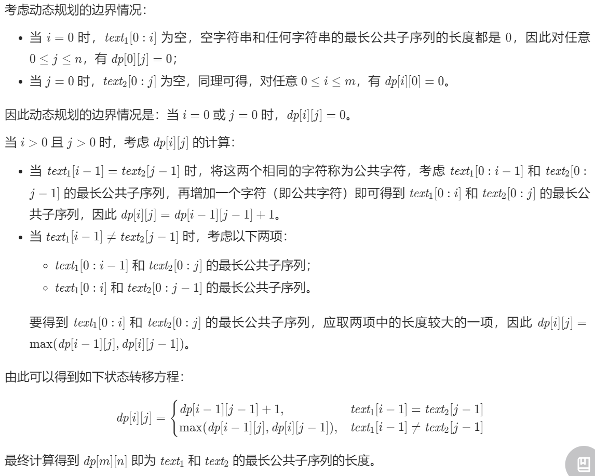

### Unsolved Problems

1. 最长回文子序列
2. 最长公共子序列
3. 股票买卖问题总结
4. 台阶问题总结

### Day1

#### [剑指 Offer 09. 用两个栈实现队列](https://leetcode.cn/problems/yong-liang-ge-zhan-shi-xian-dui-lie-lcof/)

```python
class CQueue:

    def __init__(self):
        self.res = []
        self.stack = []

    def appendTail(self, value: int) -> None:
        self.stack.append(value)

    def deleteHead(self) -> int:
        if self.res: return self.res.pop()
        if not self.stack: return -1
        while self.stack:
            self.res.apppend(self.stack.pop())
        return self.res.pop()
```

#### [剑指 Offer 30. 包含min函数的栈](https://leetcode.cn/problems/bao-han-minhan-shu-de-zhan-lcof/)

##### 1. 使用一个栈

时间5%， 空间80%。

```python
class MinStack:

    def __init__(self):
        """
        initialize your data structure here.
        """
        self.stack = []


    def push(self, x: int) -> None:
        self.stack.append(x)

    def pop(self) -> None:
        self.stack.pop()

    def top(self) -> int:
        return self.stack[-1]

    def min(self) -> int:
        return min(self.stack)
```

##### 2. 多使用一个Min_stack维护最小值

时间85%，空间33%。

```python
class MinStack:

    def __init__(self):
        """
        initialize your data structure here.
        """
        self.stack = []
        self.min_stack = [math.inf]


    def push(self, x: int) -> None:
        self.stack.append(x)
        self.min_stack.append(min(x, self.min_stack[-1]))

    def pop(self) -> None:
        self.stack.pop()
        self.min_stack.pop()

    def top(self) -> int:
        return self.stack[-1]

    def min(self) -> int:
        return self.min_stack[-1]
```

### Day2

#### [剑指 Offer 06. 从尾到头打印链表](https://leetcode.cn/problems/cong-wei-dao-tou-da-yin-lian-biao-lcof/)

```python
class Solution:
    def reversePrint(self, head: ListNode) -> List[int]:
        res = []
        if not head:
            return []
        while head:
            res.append(head.val)
            head = head.next
        res.reverse()
        return res
```

#### [剑指 Offer 24. 反转链表](https://leetcode.cn/problems/fan-zhuan-lian-biao-lcof/)

1.存储pre.next

2.利用cur作为中间值

3.交换pre和pre.next

4.pre前进为next

```python
class Solution:
    def reverseList(self, head: ListNode) -> ListNode:
        pre = head
        cur = None
        while pre != None:
            next = pre.next
            pre.next = cur
            cur = pre
            pre = next
        return cur
```

#### [剑指 Offer 35. 复杂链表的复制](https://leetcode.cn/problems/fu-za-lian-biao-de-fu-zhi-lcof/)

1.复制简单链表

```python
class Node:
    def __init__(self, x: int, next: 'Node' = None, random: 'Node' = None):
        self.val = int(x)
        self.next = next
        self.random = random
        
class Solution:
	def dupSimple(self, head:'Node') -> 'Node':
        if not head: return None
        cur = head
        copyHead = pre = Node(0)
        while cur:
            node = Node(cur.val)
            pre.next = node
            cur = cur.next
            pre = node
        return copyHead.next
```

2.复制复杂链表

```python
class Solution:
    def copyRandomList(self, head: 'Node') -> 'Node':
        if not head: return None
        cur = head
        dic = {}
        while cur:
            dic[cur] = Node(cur.val)
            cur = cur.next
        cur = head
        while cur:
            dic[cur].next = dic.get(cur.next)
            dic[cur].random = dic.get(cur.random)
            cur = cur.next
        return dic[head]
```

### Day3

#### [剑指 Offer 05. 替换空格](https://leetcode.cn/problems/ti-huan-kong-ge-lcof/)

```python
class Solution:
    def replaceSpace(self, s: str) -> str:
        res = ''
        for item in s:
            if item == ' ':
                item = '%20'
            res = res + item
        return res
```

#### [剑指 Offer 58 - II. 左旋转字符串](https://leetcode.cn/problems/zuo-xuan-zhuan-zi-fu-chuan-lcof/)

```python
class Solution:
    def reverseLeftWords(self, s: str, n: int) -> str:
        return s[n:] + s[0:n]
```

### Day4

#### [剑指 Offer 03. 数组中重复的数字](https://leetcode.cn/problems/shu-zu-zhong-zhong-fu-de-shu-zi-lcof/)

```python
class Solution:
    def findRepeatNumber(self, nums: List[int]) -> int:
        dic = {}
        for item in nums:
            if item in dic:
                return item
            dic[item] = 1
```

#### [剑指 Offer 53 - I. 在排序数组中查找数字 I](https://leetcode.cn/problems/zai-pai-xu-shu-zu-zhong-cha-zhao-shu-zi-lcof/)

1.遍历法

```python
class Solution:
    def search(self, nums: List[int], target: int) -> int:
        count = 0
        for item in nums:
            if item == target:
                count = count + 1
        return count
```

2.二分查找：有序的数组

target的index - target-1的index为重复数字的个数。

```python
class Solution:
    def search(self, nums: [int], target: int) -> int:
        def helper(tar):
            i, j = 0, len(nums) - 1
            while i <= j:
                m = (i + j) // 2
                if nums[m] <= tar: i = m + 1
                else: j = m - 1
            return i
        return helper(target) - helper(target - 1)
```

#### [剑指 Offer 53 - II. 0～n-1中缺失的数字](https://leetcode.cn/problems/que-shi-de-shu-zi-lcof/)

```python
class Solution:
    def missingNumber(self, nums: List[int]) -> int:
        std_res = [i for i in range(len(nums)+1)]
        return sum(std_res) - sum(nums)
```

### Day5

#### [剑指 Offer 04. 二维数组中的查找](https://leetcode.cn/problems/er-wei-shu-zu-zhong-de-cha-zhao-lcof/)

暴力法超时，因为是有序二维数组，可以从左下/右上角比较target和当前指针所在位置的值得大小，移动指针进行查找。

```python
class Solution:
    def findNumberIn2DArray(self, matrix: List[List[int]], target: int) -> bool:
        i, j = len(matrix) -1, 0
        while i >=0 and j < len(matrix[0]):
            if matrix[i][j] < target:
                j += 1
            elif matrix[i][j] > target:
                i -= 1
            else:
                return True
        return False
```

#### [剑指 Offer 11. 旋转数组的最小数字](https://leetcode.cn/problems/xuan-zhuan-shu-zu-de-zui-xiao-shu-zi-lcof/)

```python
class Solution:
    def minArray(self, numbers: List[int]) -> int:
        res = numbers[0]
        for i in range(1, len(numbers)):
            if numbers[i] - numbers[i-1] >= 0:
                continue
            else:
                res = numbers[i]

        return res
```

二分查找

```python
class Solution:
    def minArray(self, numbers: List[int]) -> int:
        size = len(numbers)
        if size == 0:
            return 0
        left = 0
        right = size - 1

        while left < right:
            mid = (left + right) // 2

            if numbers[mid] > numbers[right]:
                # [3, 4, 5, 1, 2]，mid 以及 mid 的左边一定不是最小数字
                # 下一轮搜索区间是[mid + 1, right]
                left = mid + 1
            elif numbers[mid] == numbers[right]:
                # 只能把 right 排除掉，下一轮搜索区间是[left, right - 1]
                right = right - 1
            else:
                # 此时 numbers[mid] < numbers[right]
                # mid 的右边一定不是最小数字，mid 有可能是，下一轮搜索区间是[left, mid]
                right = mid
        return numbers[left]
```

#### [剑指 Offer 50. 第一个只出现一次的字符](https://leetcode.cn/problems/di-yi-ge-zhi-chu-xian-yi-ci-de-zi-fu-lcof/)

```python
class Solution:
    def firstUniqChar(self, s: str) -> str:
        dic = {}
        for item in s:
            if item not in dic:
                dic[item] = 1
            else:
                dic[item] += 1
        res = [k for k,v in dic.items() if v == 1]
        if res: 
            return res[0]
        else: return ' '
```

### Day6

#### [剑指 Offer 32 - I. 从上到下打印二叉树](https://leetcode.cn/problems/cong-shang-dao-xia-da-yin-er-cha-shu-lcof/)

```python
class Solution:
    def levelOrder(self, root: TreeNode) -> List[int]:
        if not root: return []
        queue = [root]
        res = []
        while queue:
            res.append([node.val for node in queue])
            child = []
            for node in queue:
                if node.left:
                    child.append(node.left)
                if node.right:
                    child.append(node.right)
            queue = child
        return sum(res,[])
```

#### [剑指 Offer 32 - II. 从上到下打印二叉树 II](https://leetcode.cn/problems/cong-shang-dao-xia-da-yin-er-cha-shu-ii-lcof/)

```python
class Solution:
    def levelOrder(self, root: TreeNode) -> List[List[int]]:
        res = []
        if not root: return res
        queue = [root]
        while queue:
            res.append([node.val for node in queue])
            child = []
            for node in queue:
                if node.left:
                    child.append(node.left)
                if node.right:
                    child.append(node.right)
            queue = child
        return res
```

#### [剑指 Offer 32 - III. 从上到下打印二叉树 III](https://leetcode.cn/problems/cong-shang-dao-xia-da-yin-er-cha-shu-iii-lcof/)

```python
class Solution:
    def levelOrder(self, root: TreeNode) -> List[List[int]]:
        res = []
        if not root: return res
        queue = [root]
        count = 0
        while queue:
            child = []
            if count % 2 == 0:
                res.append([node.val for node in queue])
            else:
                res.append([node.val for node in reversed(queue)])
            count += 1
            for node in queue:
                if node.left:
                    child.append(node.left)
                if node.right:
                    child.append(node.right)
            queue = child
        return res
```

### Day7

#### [剑指 Offer 26. 树的子结构](https://leetcode.cn/problems/shu-de-zi-jie-gou-lcof/)

利用eachNode遍历每一个子节点，递归isSubStructure来尝试A的所有左右分支。

```python
class Solution:
    def isSubStructure(self, A: TreeNode, B: TreeNode) -> bool:
        def eachNode(A, B):
            if not B: return True
            if not A or A.val != B.val: return False
            return eachNode(A.left, B.left) and eachNode(A.right, B.right)
        
        bothNotEmpty = bool(A and B)
        return bothNotEmpty and (eachNode(A,B) or self.isSubStructure(A.left, B) or self.isSubStructure(A.right, B))
```

#### [剑指 Offer 27. 二叉树的镜像](https://leetcode.cn/problems/er-cha-shu-de-jing-xiang-lcof/)

```python
class Solution:
    def mirrorTree(self, root: TreeNode) -> TreeNode:
        if not root: return root
        left = self.mirrorTree(root.left)
        right = self.mirrorTree(root.right)
        root.left, root.right = right, left
        return root
```

#### [剑指 Offer 28. 对称的二叉树](https://leetcode.cn/problems/dui-cheng-de-er-cha-shu-lcof/)

```python
class Solution:
    def isSymmetric(self, root: TreeNode) -> bool:
        if not root: return True
        def eachNode(L, R):
            if not L and not R: return True
            if not L or not R or L.val != R.val: return False
            return eachNode(L.left, R.right) and eachNode(L.right, R.left)
    
        return eachNode(root.left, root.right)
```

### Day8

#### [剑指 Offer 10- I. 斐波那契数列](https://leetcode.cn/problems/fei-bo-na-qi-shu-lie-lcof/)

##### 1.回溯超时

```python
class Solution:
    def fib(self, n: int) -> int:
        if n == 0:
            return 0
        elif n == 1:
            return 1
        else:
            return self.fib(n-1) + self.fib(n-2)
```

##### 2.缓存节点结果

memo记录节点值

mod 1e9+7防止int溢出

```python
class Solution:
    def fib(self, n: int) -> int:
        memo = [-1 for _ in range(n+1)]
        return self.dfs(n, memo)

    def dfs(self, n, memo):
        if memo[n] != -1: return memo[n]
        if n == 0: return 0
        if n == 1: return 1
        memo[n] = (self.dfs(n-1, memo) + self.dfs(n-2, memo)) % 1000000007
        return memo[n]
```

##### 3.动态规划

从下而上

```python
class Solution:
    def fib(self, n: int) -> int:
        if n <= 1: return n
        dp = [-1 for _ in range(n+1)]
        dp[0] = 0
        dp[1] = 1
        for i in range(2, n+1):
            dp[i] = dp[i-1] + dp[i-2]
            dp[i] = dp[i] % 1000000007
        return dp[n]
```

```python
class Solution:
    def fib(self, n: int) -> int:
        a, b = 0, 1
        for _ in range(n):
            a, b = b, a + b
        return a % 1000000007
```

#### [剑指 Offer 10- II. 青蛙跳台阶问题](https://leetcode.cn/problems/qing-wa-tiao-tai-jie-wen-ti-lcof/)

f(0) = 1, f(1) = 1, f(2) = 2, f(3) = 3, f(4) = 5

```python
class Solution:
    def numWays(self, n: int) -> int:
        a, b = 1, 1
        for _ in range(n):
            a, b = b, a + b
        return a % 1000000007
# or
class Solution:
    def numWays(self, n: int) -> int:
        if n <= 1: return 1
        dp = [-1 for _ in range(n+1)]
        dp[0], dp[1] = 1, 1
        for i in range(2, n+1):
            dp[i] = dp[i-1] + dp[i-2]
            dp[i] = dp[i] % 1000000007
        return dp[n]
```

#### [剑指 Offer 63. 股票的最大利润](https://leetcode.cn/problems/gu-piao-de-zui-da-li-run-lcof/)

```python
class Solution:
    def maxProfit(self, prices: List[int]) -> int:    
        n = len(prices)
        if n <= 1: return 0
        dp = [0 for _ in range(n)]
        dp[0] = 0
        for i in range(1, n):
            dp[i] = max((prices[i] - min(prices[:i])), dp[i-1])
        return dp[n-1]
```

更快：因为不用每次都从数组找min。

```python
class Solution:
    def maxProfit(self, prices: List[int]) -> int:
        cost, profit = float("+inf"), 0
        for price in prices:
            cost = min(cost, price)
            profit = max(profit, price - cost)
        return profit
```

### Day9

#### [剑指 Offer 42. 连续子数组的最大和](https://leetcode.cn/problems/lian-xu-zi-shu-zu-de-zui-da-he-lcof/)

```python
class Solution:
    def maxSubArray(self, nums: List[int]) -> int:
        if len(nums) == 1: return nums[0]
        ans, max_sum = float("-inf"), 0
        for i in range(0,len(nums)):
            max_sum = max(max_sum + nums[i], nums[i])
            ans = max(max_sum, ans)
        return ans
```

#### [剑指 Offer 47. 礼物的最大价值](https://leetcode.cn/problems/li-wu-de-zui-da-jie-zhi-lcof/)

```python
class Solution:
    def maxValue(self, grid: List[List[int]]) -> int:
        if not grid: return 0
        directions = [(0,1), (1,0)]
        n, m = len(grid), len(grid[0])
        for i in range(n):
            for j in range(m):
                if i == 0 and j == 0: continue
                if i == 0: grid[i][j] += grid[i][j - 1]
                elif j == 0: grid[i][j] += grid[i - 1][j]
                else:
                    grid[i][j] += max(grid[i][j - 1], grid[i - 1][j])
        return grid[-1][-1]
```

边界简化

```python
class Solution:
    def maxValue(self, grid: List[List[int]]) -> int:
        n, m = len(grid), len(grid[0])
        for i in range(1, n):
            grid[i][0] += grid[i - 1][0]
        for j in range(1, m):
            grid[0][j] += grid[0][j - 1]

        for i in range(1, n):
            for j in range(1, m):
                grid[i][j] += max(grid[i - 1][j], grid[i][j - 1])
        return grid[-1][-1]
```

### Day10

#### [剑指 Offer 46. 把数字翻译成字符串](https://leetcode.cn/problems/ba-shu-zi-fan-yi-cheng-zi-fu-chuan-lcof/)

```python
class Solution:
    def translateNum(self, num: int) -> int:
        if num > 9 and num < 26: return 2
        if num < 10 or (num > 25 and num < 100): return 1
        dp = []
        dp.append(1)
        dp.append(1)
        num = str(num)
        for i in range(2, len(num) + 1):
            lastTwo = int(num[i-2]) * 10 + int(num[i - 1])
            if lastTwo > 9 and lastTwo < 26:
                dp.append(dp[i - 1] + dp[i - 2])
            else:
                dp.append(dp[i - 1])
        return dp[-1]
```

```python
class Solution:
    def translateNum(self, num: int) -> int:
        nums = str(num)
        a = b = 1
        for i in range(2, len(nums) + 1):
            tmp = nums[i-2:i]
            c = a + b if 9 < int(tmp) < 26 else b
            a = b
            b = c
        return b
```


#### [剑指 Offer 48. 最长不含重复字符的子字符串](https://leetcode.cn/problems/zui-chang-bu-han-zhong-fu-zi-fu-de-zi-zi-fu-chuan-lcof/)

方法一（自创）：需要改进

```python
class Solution:
    def lengthOfLongestSubstring(self, s: str) -> int:
        if len(s) == 0: return 0
        max_len = 1
        start = 0
        for i in range(1, len(s)):
            if s[i] in s[start:(i-1)]:
                max_len = i - start
                start = i
            else: max_len += 1
        return max_len
```

方法二：

```python
class Solution:
    def lengthOfLongestSubstring(self, s: str) -> int:
        dic = {}
        i, res = -1, 0
        for j in range(0, len(s)):
            if s[j] in dic:
                i = max(dic[s[j]], i)
            dic[s[j]] = j
            res = max(j-i, res)
            print(res)
        return res
```

#### [最长回文子串——动态规划补充](https://leetcode.cn/problems/longest-palindromic-substring/solution/5-zui-chang-hui-wen-zi-chuan-dong-tai-gu-p7uk/)

用start定义开始的标记，max_len标记回文子串长度。

##### Step1. 定义动态规划

定义$dp[i][j]$ 为i,j+1之间是否为回文，布尔值类型。

##### Step2. 确定边界条件

子串长度不大于3时只要头尾相等就可以返回True，标记为回文

##### Step3. 状态转移

首尾相等+去掉收尾依然True.

```python
class Solution:
    def longestPalindrome(self, s: str) -> str:
        
        size = len(s)
        # 特殊处理
        if size == 1:
            return s
        # 创建动态规划dynamic programing表
        dp = [[False for _ in range(size)] for _ in range(size)]
        # 初始长度为1，这样万一不存在回文，就返回第一个值（初始条件设置的时候一定要考虑输出）
        max_len = 1
        start = 0
        for j in range(1,size):
            for i in range(j):
                # 边界条件：
                # 只要头尾相等（s[i]==s[j]）就能返回True
                if j-i<=2:
                    if s[i]==s[j]:
                        dp[i][j] = True
                        cur_len = j-i+1
                # 状态转移方程 
                # 当前dp[i][j]状态：头尾相等（s[i]==s[j]）
                # 过去dp[i][j]状态：去掉头尾之后还是一个回文（dp[i+1][j-1] is True）
                else:
                    if s[i]==s[j] and dp[i+1][j-1]:
                        dp[i][j] = True
                        cur_len = j-i+1
                # 出现回文更新输出
                if dp[i][j]:
                    if cur_len > max_len:
                        max_len = cur_len
                        start = i

        return s[start:start+max_len]
```

#### [最长公共子序列——动态规划补充](https://leetcode.cn/problems/qJnOS7/)



```python
class Solution:
    def longestCommonSubsequence(self, text1: str, text2: str) -> int:
        m, n = len(text1), len(text2)
        dp = [[0 for _ in range(n+1)] for _ in range(m+1)]
        for i in range(1, m+1):
            for j in range(1, n+1):
                if text1[i - 1] == text2[j - 1]:
                    dp[i][j] = dp[i - 1][j - 1] + 1
                else:
                    dp[i][j] = max(dp[i - 1][j], dp[i][j - 1])
        return dp[m][n]
```

### 台阶问题


### Day11

#### [剑指 Offer 18. 删除链表的节点](https://leetcode.cn/problems/shan-chu-lian-biao-de-jie-dian-lcof/)

```python
# Definition for singly-linked list.
# class ListNode:
#     def __init__(self, x):
#         self.val = x
#         self.next = None
class Solution:
    def deleteNode(self, head: ListNode, val: int) -> ListNode:
        if head.val == val: return head.next
        pre, cur = head, head.next
        while cur and cur.val != val:
            pre, cur = cur, cur.next
        if cur: pre.next = cur.next
        return head
```

#### [剑指 Offer 22. 链表中倒数第k个节点](https://leetcode.cn/problems/lian-biao-zhong-dao-shu-di-kge-jie-dian-lcof/)

```python
# Definition for singly-linked list.
# class ListNode:
#     def __init__(self, x):
#         self.val = x
#         self.next = None

class Solution:
    def getKthFromEnd(self, head: ListNode, k: int) -> ListNode:
        pre = head
        length = 0
        while pre:
            pre = pre.next
            length += 1
        pre = head
        while length - k > 0:
            length -= 1
            pre = pre.next
        return pre

```

### Day12

#### [剑指 Offer 25. 合并两个排序的链表](https://leetcode.cn/problems/he-bing-liang-ge-pai-xu-de-lian-biao-lcof/)

```python
# Definition for singly-linked list.
# class ListNode:
#     def __init__(self, x):
#         self.val = x
#         self.next = None
class Solution:
    def mergeTwoLists(self, l1: ListNode, l2: ListNode) -> ListNode:
        cur = dummy = ListNode(-1)
        while l1 and l2:
            if l1.val > l2.val:
                cur.next = l2
                l2 = l2.next
            else:
                cur.next = l1
                l1 = l1.next
            cur = cur.next
        cur.next = l1 if l1 else l2
        return dummy.next
```

### Day14

#### [剑指 Offer 12. 矩阵中的路径](https://leetcode.cn/problems/ju-zhen-zhong-de-lu-jing-lcof/)

```python
class Solution:    
    def exist(self, board: List[List[str]], word: str) -> bool:
        def dfs(i, j, k):
            if not 0 <= i < len(board) or not 0<= j < len(board[0]) or board[i][j] != word[k]: 
                return False
            if k == len(word) - 1: return True
            # 修改board为空防止重复访问
            board[i][j] = ''
            res = dfs(i+1, j, k+1) or dfs(i, j+1, k+1) or dfs(i-1, j, k+1) or dfs(i, j-1, k+1)
            # 将board改回word[k],进入该条件必然board[i][j]与word[k]相等
            board[i][j] = word[k]
            return res
        
        for i in range(len(board)):
            for j in range(len(board[0])):
                if dfs(i, j, 0):
                    return True
        return False
```


#### [剑指 Offer II 088. 爬楼梯的最少成本](https://leetcode.cn/problems/GzCJIP/)

```python
class Solution:
    def minCostClimbingStairs(self, cost: List[int]) -> int:
        n = len(cost)
        dp = [0] * (n + 1)
        for i in range(2, n+1):
            dp[i] = min(dp[i-1]+cost[i-1], dp[i-2]+cost[i-2])
        return dp[-1]
```

